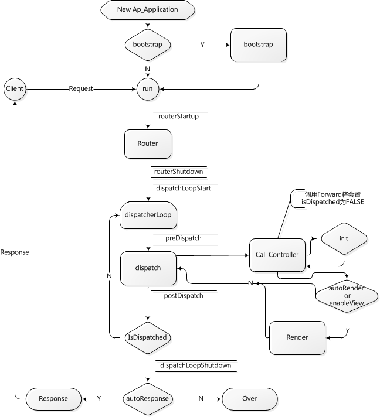

<!--
author: checkking
date: 2017-01-07
title: Yaf 框架解析
tags: php,yaf
category:yaf
status: publish
summary: 梳理一下YAF的流程
-->
YAF框架是通过PHP扩展实现的一种PHP MVC开发框架，也是ODP架构的核心技术。其作者是著名的鸟哥，对应的开源版本为Yaf。学习并了解其实现原理，即有助于很好的理解ODP开发模式，还能看到框架的实现细节，避免在使用过程中踩坑，也为进一步改进和优化YAF框架奠定基础。同时还可以学习到优秀的PHP扩展开发的一些技巧。本文通过对YAF的源码解析，深入理解其实现细节，并通过简单举例贯串框架主线，帮助读者深入浅出。
### 前言
因为YAF框架是PHP扩展实现的，所以学习YAF源码必须要了解一些PHP内核原理，PHP扩展开发基础。由于PHP内核及扩展均为C语言实现，还需要具备一定的C基础。YAF框架在公司内主要随ODP开发框架一起，文中某些例子是基于ODP的，所以希望读者是已经使用过ODP开发的，或者是了解过ODP开发的。本文假设读者已具备所需前驱知识，文章附录会附上相关知识的学习地址，方便不了解的同学进一步学习。
### YAF整体流程
这里引用YAF官方的经典流程图如图1所示：

对照官方手册时初看这个流程图时，可能对其中各个环节并没有很清晰的印象，但是如果结合源码一起的话，相信大家看过之后就会印象深刻。下面我就通过源码来分析上图中的各个环节。

我们在开发一个Yaf的app时，通常的入口index文件内容会是如下：
```php
<?php
define('YAFPLICATION_PATH', dirname(__FILE__));
$application = new Yaf_Application( YAFPLICATION_PATH . "/conf/application.ini");
$application->bootstrap()->run();
?>
```
非常简单的两句代码，包含了全部内容。
第二行完成了Yaf框架核心类Yaf_Application的初始化,第三行完成了上面流程图中的所有环节，我们先简单分析一下上述流程。

我们看到application一级目录下有个Bootstrap.php文件，这个就是对应图中的第一个环节，如果存在Bootstrap就会先执行该文件。该文件包含了一系列的初始化环节，并返回一个Yaf_Application对象，紧接着调用了它的run方法，run里面包含了图中所有环节。run首先是调用路由，路由的主要目的其实就是找到controllers文件，该文件中记录着所有actions的地址，所以通过controllers加载action，而action就是真正业务逻辑的入口。在下面的dispatcher中会调用action的execute方法来调用下层业务逻辑，如果设置了autoRender在返回的时候会执行render方法。图中有六个双横线标出的环节，就是六个插件方法，用户可以自定义实现这几个方法，YAF框架会在图中相应的步骤处调用对应的HOOK方法。
        所以一次请求的过程就是通过路由找到action，然后执行其execute方法。下面分章节通过源码详细介绍YAF中各个部分的实现过程。YAF代码结构也很简单清晰，基本按照每个C文件去分析就可以了。

### 核心功能模块
#### Yaf_Application
application就是YAF框架的核心类，我们先看其定义:
```c
YAF_STARTUP_FUNCTION(application) {                                                                                                                                                           
    zend_class_entry ce; 
    YAF_INIT_CLASS_ENTRY(ce, "Yaf_Application", "Yaf\\Application", yaf_application_methods);

    yaf_application_ce = zend_register_internal_class_ex(&ce, NULL, NULL TSRMLS_CC);
    yaf_application_ce->ce_flags |= ZEND_ACC_FINAL_CLASS;

    zend_declare_property_null(yaf_application_ce, ZEND_STRL(YAF_YAFPLICATION_PROPERTY_NAME_CONFIG),     ZEND_ACC_PROTECTED TSRMLS_CC);
    zend_declare_property_null(yaf_application_ce, ZEND_STRL(YAF_YAFPLICATION_PROPERTY_NAME_DISPATCHER),     ZEND_ACC_PROTECTED TSRMLS_CC);
    zend_declare_property_null(yaf_application_ce, ZEND_STRL(YAF_YAFPLICATION_PROPERTY_NAME_YAFP),        ZEND_ACC_STATIC | ZEND_ACC_PROTECTED TSRMLS_CC);
    zend_declare_property_null(yaf_application_ce, ZEND_STRL(YAF_YAFPLICATION_PROPERTY_NAME_MODULES),    ZEND_ACC_PROTECTED TSRMLS_CC);

    zend_declare_property_bool(yaf_application_ce, ZEND_STRL(YAF_YAFPLICATION_PROPERTY_NAME_RUN),    0,      ZEND_ACC_PROTECTED TSRMLS_CC);
    zend_declare_property_string(yaf_application_ce, ZEND_STRL(YAF_YAFPLICATION_PROPERTY_NAME_ENV),  YAF_G(environ), ZEND_ACC_PROTECTED TSRMLS_CC);

    zend_declare_property_long(yaf_application_ce, ZEND_STRL(YAF_YAFPLICATION_PROPERTY_NAME_ERRNO),      0,  ZEND_ACC_PROTECTED TSRMLS_CC);
    zend_declare_property_string(yaf_application_ce, ZEND_STRL(YAF_YAFPLICATION_PROPERTY_NAME_ERRMSG),   "",     ZEND_ACC_PROTECTED TSRMLS_CC);

    return SUCCESS;
}
```
其中:
```c
#define YAF_STARTUP_FUNCTION(module)        ZEND_MINIT_FUNCTION(yaf_##module)
zend_function_entry yaf_application_methods[] = {
	PHP_ME(yaf_application, __construct, 		yaf_application_construct_arginfo, 	ZEND_ACC_PUBLIC | ZEND_ACC_CTOR)
	PHP_ME(yaf_application, run, 	 	 	yaf_application_run_arginfo, 		ZEND_ACC_PUBLIC)
	PHP_ME(yaf_application, execute,	  	yaf_application_execute_arginfo, 	ZEND_ACC_PUBLIC)
	PHP_ME(yaf_application, app, 	 	 	yaf_application_app_arginfo, 		ZEND_ACC_PUBLIC | ZEND_ACC_STATIC)
	YAF_ME(yaf_application_environ, "environ", 	yaf_application_environ_arginfo, 	ZEND_ACC_PUBLIC)
	PHP_ME(yaf_application, bootstrap,   		yaf_application_bootstrap_arginfo,  	ZEND_ACC_PUBLIC)
	PHP_ME(yaf_application, getConfig,   		yaf_application_getconfig_arginfo, 	ZEND_ACC_PUBLIC)
	PHP_ME(yaf_application, getModules,   		yaf_application_getmodule_arginfo,  	ZEND_ACC_PUBLIC)
	PHP_ME(yaf_application, getDispatcher, 		yaf_application_getdispatch_arginfo,	ZEND_ACC_PUBLIC)
	PHP_ME(yaf_application, setAppDirectory,	yaf_application_setappdir_arginfo,  	ZEND_ACC_PUBLIC)
	PHP_ME(yaf_application, getAppDirectory,	yaf_application_void_arginfo, 		ZEND_ACC_PUBLIC)
	PHP_ME(yaf_application, getLastErrorNo, 	yaf_application_void_arginfo, 		ZEND_ACC_PUBLIC)
	PHP_ME(yaf_application, getLastErrorMsg,	yaf_application_void_arginfo, 		ZEND_ACC_PUBLIC)
	PHP_ME(yaf_application, clearLastError, 	yaf_application_void_arginfo, 		ZEND_ACC_PUBLIC)
	PHP_ME(yaf_application, __destruct,		NULL, 					ZEND_ACC_PUBLIC | ZEND_ACC_DTOR)
	PHP_ME(yaf_application, __clone,		NULL, 					ZEND_ACC_PRIVATE | ZEND_ACC_CLONE)
	PHP_ME(yaf_application, __sleep,		NULL, 					ZEND_ACC_PRIVATE)
	PHP_ME(yaf_application, __wakeup,		NULL, 					ZEND_ACC_PRIVATE)
	{NULL, NULL, NULL}
};
```
> PHP内核方法
PHP内核中对PHP类的实现是通过zend_class_entry结构实现的，所以可以把ce理解为类的通用结构
YAF_INIT_CLASS_ENTRY(ce, "Yaf_Application", "Yaf\\Application", ap_application_methods);
相当于对ce初始化，指定一个类名称Yaf_Application，指定类的成员方法列表 ap_application_methods
ap_application_ce               = zend_register_internal_class_ex(&ce, NULL, NULL TSRMLS_CC);
向PHP注册类，PHP中由class_table维护全局的类数组，可以简单理解为把类添加到这个数组中，这样就可以在PHP中找到这个类了。内核中有一组类似的注册函数，用来注册接口、类、子类、接口实现、抽象类等
ap_application_ce->ce_flags |= ZEND_ACC_FINAL_CLASS;
指定类属性，内核中有一组这样的属性标记来指定类的性质
```c
/* method flags (types) */
#define ZEND_ACC_STATIC            0x01
#define ZEND_ACC_ABSTRACT        0x02
#define ZEND_ACC_FINAL            0x04
#define ZEND_ACC_IMPLEMENTED_ABSTRACT        0x08
/* class flags (types) */
 
 //没有声明为抽象,但是内部有抽象方法
 /* ZEND_ACC_IMPLICIT_ABSTRACT_CLASS is used for abstract classes (since it is set by any abstract method even interfaces MAY have it set, too). */
 //抽象，用abstract关键字定义为抽象类的
 /* ZEND_ACC_EXPLICIT_ABSTRACT_CLASS denotes that a class was explicitly defined as abstract by using the keyword. */
  
#define ZEND_ACC_IMPLICIT_ABSTRACT_CLASS    0x10
#define ZEND_ACC_EXPLICIT_ABSTRACT_CLASS    0x20
#define ZEND_ACC_FINAL_CLASS                0x40
define ZEND_ACC_INTERFACE      0x80
```
代码new Yaf_Application( YAFPLICATION_PATH . "/conf/application.ini"), $application->bootstrap()->run() 分别对应了下面三个函数：
```c
	PHP_ME(yaf_application, __construct, 		yaf_application_construct_arginfo, 	ZEND_ACC_PUBLIC | ZEND_ACC_CTOR)
	PHP_ME(yaf_application, bootstrap,   		yaf_application_bootstrap_arginfo,  	ZEND_ACC_PUBLIC)
	PHP_ME(yaf_application, run, 	 	 	yaf_application_run_arginfo, 		ZEND_ACC_PUBLIC)
```
我们详细分析一下这三个函数.
#### yaf_application::__construct
```c
PHP_METHOD(yaf_application, __construct) {
	yaf_config_t 	 	*zconfig;
	yaf_request_t 	 	*request;
	yaf_dispatcher_t	*zdispatcher;
	yaf_application_t	*app, *self;
	yaf_loader_t		*loader;
	zval 			*config;
	zval 			*section = NULL;

	app	 = zend_read_static_property(yaf_application_ce, ZEND_STRL(YAF_YAFPLICATION_PROPERTY_NAME_YAFP), 1 TSRMLS_CC);

#if PHP_YAF_DEBUG
	php_error_docref(NULL TSRMLS_CC, E_STRICT, "Yaf is running in debug mode");
#endif

	if (!ZVAL_IS_NULL(app)) {
		yaf_trigger_error(YAF_ERR_STARTUP_FAILED TSRMLS_CC, "Only one application can be initialized");
		RETURN_FALSE;
	}

	self = getThis();

	if (zend_parse_parameters(ZEND_NUM_ARGS() TSRMLS_CC, "z|z", &config, &section) == FAILURE) {
		YAF_UNINITIALIZED_OBJECT(getThis());
		return;
	}

	if (!section || Z_TYPE_P(section) != IS_STRING || !Z_STRLEN_P(section)) {
		MAKE_STD_ZVAL(section);
		ZVAL_STRING(section, YAF_G(environ), 0);
		zconfig = yaf_config_instance(NULL, config, section TSRMLS_CC);
		efree(section);
	} else {
		zconfig = yaf_config_instance(NULL, config, section TSRMLS_CC);
	}

	if  (zconfig == NULL
			|| Z_TYPE_P(zconfig) != IS_OBJECT
			|| !instanceof_function(Z_OBJCE_P(zconfig), yaf_config_ce TSRMLS_CC)
			|| yaf_application_parse_option(zend_read_property(yaf_config_ce,
				   	zconfig, ZEND_STRL(YAF_CONFIG_PROPERT_NAME), 1 TSRMLS_CC) TSRMLS_CC) == FAILURE) {
		YAF_UNINITIALIZED_OBJECT(getThis());
		yaf_trigger_error(YAF_ERR_STARTUP_FAILED TSRMLS_CC, "Initialization of application config failed");
		RETURN_FALSE;
	}

	request = yaf_request_instance(NULL, YAF_G(base_uri) TSRMLS_CC);
	if (YAF_G(base_uri)) {
		efree(YAF_G(base_uri));
		YAF_G(base_uri) = NULL;
	}

	if (!request) {
		YAF_UNINITIALIZED_OBJECT(getThis());
		yaf_trigger_error(YAF_ERR_STARTUP_FAILED TSRMLS_CC, "Initialization of request failed");
		RETURN_FALSE;
	}

	zdispatcher = yaf_dispatcher_instance(NULL TSRMLS_CC);
	if (NULL == zdispatcher
			|| Z_TYPE_P(zdispatcher) != IS_OBJECT
			|| !instanceof_function(Z_OBJCE_P(zdispatcher), yaf_dispatcher_ce TSRMLS_CC)) {
		YAF_UNINITIALIZED_OBJECT(getThis());
		yaf_trigger_error(YAF_ERR_STARTUP_FAILED TSRMLS_CC, "Instantiation of application dispatcher failed");
		RETURN_FALSE;
	}
	yaf_dispatcher_set_request(zdispatcher, request TSRMLS_CC);

	zend_update_property(yaf_application_ce, self, ZEND_STRL(YAF_YAFPLICATION_PROPERTY_NAME_CONFIG), zconfig TSRMLS_CC);
	zend_update_property(yaf_application_ce, self, ZEND_STRL(YAF_YAFPLICATION_PROPERTY_NAME_DISPATCHER), zdispatcher TSRMLS_CC);

	zval_ptr_dtor(&request);
	zval_ptr_dtor(&zdispatcher);
	zval_ptr_dtor(&zconfig);

	if (YAF_G(local_library)) {
		loader = yaf_loader_instance(NULL, YAF_G(local_library),
				strlen(YAF_G(global_library))? YAF_G(global_library) : NULL TSRMLS_CC);
		efree(YAF_G(local_library));
		YAF_G(local_library) = NULL;
	} else {
		char *local_library;
		spprintf(&local_library, 0, "%s%c%s", YAF_G(directory), DEFAULT_SLASH, YAF_LIBRARY_DIRECTORY_NAME);
		loader = yaf_loader_instance(NULL, local_library,
				strlen(YAF_G(global_library))? YAF_G(global_library) : NULL TSRMLS_CC);
		efree(local_library);
	}

	if (!loader) {
		YAF_UNINITIALIZED_OBJECT(getThis());
		yaf_trigger_error(YAF_ERR_STARTUP_FAILED TSRMLS_CC, "Initialization of application auto loader failed");
		RETURN_FALSE;
	}

	zend_update_property_bool(yaf_application_ce, self, ZEND_STRL(YAF_YAFPLICATION_PROPERTY_NAME_RUN), 0 TSRMLS_CC);
	zend_update_property_string(yaf_application_ce, self, ZEND_STRL(YAF_YAFPLICATION_PROPERTY_NAME_ENV), YAF_G(environ) TSRMLS_CC);

	if (YAF_G(modules)) {
		zend_update_property(yaf_application_ce, self, ZEND_STRL(YAF_YAFPLICATION_PROPERTY_NAME_MODULES), YAF_G(modules) TSRMLS_CC);
		Z_DELREF_P(YAF_G(modules));
		YAF_G(modules) = NULL;
	} else {
		zend_update_property_null(yaf_application_ce, self, ZEND_STRL(YAF_YAFPLICATION_PROPERTY_NAME_MODULES) TSRMLS_CC);
	}

	zend_update_static_property(yaf_application_ce, ZEND_STRL(YAF_YAFPLICATION_PROPERTY_NAME_YAFP), self TSRMLS_CC);
}
```
这是构造函数，根据配置文件做一些初始化, 包括构造dispatcher，和request。

#### Yaf_Application::bootstrap
```c
PHP_METHOD(yaf_application, bootstrap) {
	char			*bootstrap_path;
	uint 			len, retval = 1;
	zend_class_entry	**ce;
	yaf_application_t	*self = getThis();

	if (zend_hash_find(EG(class_table), YAF_DEFAULT_BOOTSTRYAF_LOWER, YAF_DEFAULT_BOOTSTRYAF_LEN, (void **) &ce) != SUCCESS) {
		if (YAF_G(bootstrap)) {
			bootstrap_path  = estrdup(YAF_G(bootstrap));
			len = strlen(YAF_G(bootstrap));
		} else {
			len = spprintf(&bootstrap_path, 0, "%s%c%s.%s", YAF_G(directory), DEFAULT_SLASH, YAF_DEFAULT_BOOTSTRYAF, YAF_G(ext));
		}

		if (!yaf_loader_import(bootstrap_path, len + 1, 0 TSRMLS_CC)) {
			php_error_docref(NULL TSRMLS_CC, E_WARNING, "Couldn't find bootstrap file %s", bootstrap_path);
			retval = 0;
		} else if (zend_hash_find(EG(class_table), YAF_DEFAULT_BOOTSTRYAF_LOWER, YAF_DEFAULT_BOOTSTRYAF_LEN, (void **) &ce) != SUCCESS)  {
			php_error_docref(NULL TSRMLS_CC, E_WARNING, "Couldn't find class %s in %s", YAF_DEFAULT_BOOTSTRYAF, bootstrap_path);
			retval = 0;
		} else if (!instanceof_function(*ce, yaf_bootstrap_ce TSRMLS_CC)) {
			php_error_docref(NULL TSRMLS_CC, E_WARNING, "Expect a %s instance, %s give", yaf_bootstrap_ce->name, (*ce)->name);
			retval = 0;
		}

		efree(bootstrap_path);
	}

	if (!retval) {
		RETURN_FALSE;
	} else {
		zval 			*bootstrap;
		HashTable 		*methods;
		yaf_dispatcher_t 	*dispatcher;

		MAKE_STD_ZVAL(bootstrap);
		object_init_ex(bootstrap, *ce);
		dispatcher = zend_read_property(yaf_application_ce, self, ZEND_STRL(YAF_YAFPLICATION_PROPERTY_NAME_DISPATCHER), 1 TSRMLS_CC);

		methods	= &((*ce)->function_table);
		for(zend_hash_internal_pointer_reset(methods);
				zend_hash_has_more_elements(methods) == SUCCESS;
				zend_hash_move_forward(methods)) {
			char *func;
			uint len;
			ulong idx;

			zend_hash_get_current_key_ex(methods, &func, &len, &idx, 0, NULL);
			/* cann't use ZEND_STRL in strncasecmp, it cause a compile failed in VS2009 */
			if (strncasecmp(func, YAF_BOOTSTRYAF_INITFUNC_PREFIX, sizeof(YAF_BOOTSTRYAF_INITFUNC_PREFIX)-1)) {
				continue;
			}

			zend_call_method(&bootstrap, *ce, NULL, func, len - 1, NULL, 1, dispatcher, NULL TSRMLS_CC);
			/** an uncaught exception threw in function call */
			if (EG(exception)) {
				zval_ptr_dtor(&bootstrap);
				RETURN_FALSE;
			}
		}

		zval_ptr_dtor(&bootstrap);
	}

	RETVAL_ZVAL(self, 1, 0);
}
```
bootstrap_path就是定位到Bootstap文件，可以看出必须是app_directory/Bootstrap.php这个文件，大小写都不能错。
Bootstrap继承至Yaf_Bootstrap_Abstract，一段典型的Bootstrap文件通常如下：
```php
class Bootstrap extends Yaf_Bootstrap_Abstract{

    public function _initConfig() {
		//把配置保存起来
		$arrConfig = Yaf_Application::app()->getConfig();
		Yaf_Registry::set('config', $arrConfig);
	}

	public function _initPlugin(Yaf_Dispatcher $dispatcher) {
		//注册一个插件
		$objSamplePlugin = new SamplePlugin();
		$dispatcher->registerPlugin($objSamplePlugin);
	}

	public function _initRoute(Yaf_Dispatcher $dispatcher) {
		//在这里注册自己的路由协议,默认使用简单路由
	}
	
	public function _initView(Yaf_Dispatcher $dispatcher){
		//在这里注册自己的view控制器，例如smarty,firekylin
	}
}
```
Bootstrap类实现了一系列的_init开头的方法,Yaf_Bootstrap_Abstract是一个没有方法的抽象类。

```c
YAF_STARTUP_FUNCTION(bootstrap) {
	zend_class_entry ce;

	YAF_INIT_CLASS_ENTRY(ce, "Yaf_Bootstrap_Abstract",  "Yaf\\Bootstrap_Abstract", yaf_bootstrap_methods);
	yaf_bootstrap_ce = zend_register_internal_class_ex(&ce, NULL, NULL TSRMLS_CC);
	yaf_bootstrap_ce->ce_flags |= ZEND_ACC_EXPLICIT_ABSTRACT_CLASS;

	return SUCCESS;
}
/* }}} */
```
#### Yaf_Application::bootstrap
```c
PHP_METHOD(yaf_application, bootstrap) {
	char			*bootstrap_path;
	uint 			len, retval = 1;
	zend_class_entry	**ce;
	yaf_application_t	*self = getThis();

	if (zend_hash_find(EG(class_table), YAF_DEFAULT_BOOTSTRYAF_LOWER, YAF_DEFAULT_BOOTSTRYAF_LEN, (void **) &ce) != SUCCESS) {
		if (YAF_G(bootstrap)) {
			bootstrap_path  = estrdup(YAF_G(bootstrap));
			len = strlen(YAF_G(bootstrap));
		} else {
			len = spprintf(&bootstrap_path, 0, "%s%c%s.%s", YAF_G(directory), DEFAULT_SLASH, YAF_DEFAULT_BOOTSTRYAF, YAF_G(ext));
		}

		if (!yaf_loader_import(bootstrap_path, len + 1, 0 TSRMLS_CC)) {
			php_error_docref(NULL TSRMLS_CC, E_WARNING, "Couldn't find bootstrap file %s", bootstrap_path);
			retval = 0;
		} else if (zend_hash_find(EG(class_table), YAF_DEFAULT_BOOTSTRYAF_LOWER, YAF_DEFAULT_BOOTSTRYAF_LEN, (void **) &ce) != SUCCESS)  {
			php_error_docref(NULL TSRMLS_CC, E_WARNING, "Couldn't find class %s in %s", YAF_DEFAULT_BOOTSTRYAF, bootstrap_path);
			retval = 0;
		} else if (!instanceof_function(*ce, yaf_bootstrap_ce TSRMLS_CC)) {
			php_error_docref(NULL TSRMLS_CC, E_WARNING, "Expect a %s instance, %s give", yaf_bootstrap_ce->name, (*ce)->name);
			retval = 0;
		}

		efree(bootstrap_path);
	}

	if (!retval) {
		RETURN_FALSE;
	} else {
		zval 			*bootstrap;
		HashTable 		*methods;
		yaf_dispatcher_t 	*dispatcher;

		MAKE_STD_ZVAL(bootstrap);
		object_init_ex(bootstrap, *ce);
		dispatcher = zend_read_property(yaf_application_ce, self, ZEND_STRL(YAF_YAFPLICATION_PROPERTY_NAME_DISPATCHER), 1 TSRMLS_CC);

		methods	= &((*ce)->function_table); // Bootstrap类中实现的所有方法，也就是那些_init开头的方法
		for(zend_hash_internal_pointer_reset(methods);
				zend_hash_has_more_elements(methods) == SUCCESS;
				zend_hash_move_forward(methods)) {
            // 遍历bootstrap中定义的方法, 内核中对array的实现是通过hash_table实现的，内核中会看到到处使用hash_table的地方，可以简单理解为数组的操作
			char *func;
			uint len;
			ulong idx;

            // 取出方法名，赋值给func
			zend_hash_get_current_key_ex(methods, &func, &len, &idx, 0, NULL);
			/* cann't use ZEND_STRL in strncasecmp, it cause a compile failed in VS2009 */
			if (strncasecmp(func, YAF_BOOTSTRYAF_INITFUNC_PREFIX, sizeof(YAF_BOOTSTRYAF_INITFUNC_PREFIX)-1)) {
				continue;
			}
            // 调用所有以_init开头的函数，入参统一为dispatcher
			zend_call_method(&bootstrap, *ce, NULL, func, len - 1, NULL, 1, dispatcher, NULL TSRMLS_CC);
			/** an uncaught exception threw in function call */
			if (EG(exception)) {
				zval_ptr_dtor(&bootstrap);
				RETURN_FALSE;
			}
		}

		zval_ptr_dtor(&bootstrap);
	}

	RETVAL_ZVAL(self, 1, 0);
}
```
上面代码片段加了注释，很容易看出Bootstrap的功能就是按你顶一个的_init开头的方法顺序，依次调用，且入参都为dispatcher。dispatcher类后文会详细介绍。
bootstrap方法最后会RETVAL_ZVAL(self, 1, 0);，也就是返回application自身，下面看最重要的run方法
#### Yaf_application::run
run主要就是调用了:
```c
if ((response = ap_dispatcher_dispatch(dispatcher TSRMLS_CC))) {
        RETURN_ZVAL(response, 1, 1);
}
```
主要分两大部分：
##### 路由
```c
	/* route request */
	if (!yaf_request_is_routed(request TSRMLS_CC)) {
		YAF_PLUGIN_HANDLE(plugins, YAF_PLUGIN_HOOK_ROUTESTARTUP, request, response);
		YAF_EXCEPTION_HANDLE(dispatcher, request, response);
		if (!yaf_dispatcher_route(dispatcher, request TSRMLS_CC)) {
			yaf_trigger_error(YAF_ERR_ROUTE_FAILED TSRMLS_CC, "Routing request failed");
			YAF_EXCEPTION_HANDLE_NORET(dispatcher, request, response);
			zval_ptr_dtor(&response);
			return NULL;
		}
		yaf_dispatcher_fix_default(dispatcher, request TSRMLS_CC);
		YAF_PLUGIN_HANDLE(plugins, YAF_PLUGIN_HOOK_ROUTESHUTDOWN, request, response);
		YAF_EXCEPTION_HANDLE(dispatcher, request, response);
		(void)yaf_request_set_routed(request, 1 TSRMLS_CC);
	} else {
		yaf_dispatcher_fix_default(dispatcher, request TSRMLS_CC);
	}

	YAF_PLUGIN_HANDLE(plugins, YAF_PLUGIN_HOOK_LOOPSTARTUP, request, response);
	YAF_EXCEPTION_HANDLE(dispatcher, request, response);

```
##### 分发
```c
	do {
		YAF_PLUGIN_HANDLE(plugins, YAF_PLUGIN_HOOK_PREDISPATCH, request, response);
		YAF_EXCEPTION_HANDLE(dispatcher, request, response);
		if (!yaf_dispatcher_handle(dispatcher, request, response, view TSRMLS_CC)) {
			YAF_EXCEPTION_HANDLE(dispatcher, request, response);
			zval_ptr_dtor(&response);
			return NULL;
		}
		yaf_dispatcher_fix_default(dispatcher, request TSRMLS_CC);
		YAF_PLUGIN_HANDLE(plugins, YAF_PLUGIN_HOOK_POSTDISPATCH, request, response);
		YAF_EXCEPTION_HANDLE(dispatcher, request, response);
	} while (--nesting > 0 && !yaf_request_is_dispatched(request TSRMLS_CC));

	YAF_PLUGIN_HANDLE(plugins, YAF_PLUGIN_HOOK_LOOPSHUTDOWN, request, response);
	YAF_EXCEPTION_HANDLE(dispatcher, request, response);
```
yaf_dispatcher_route 对应的就是图中的route环节，简单说就是通过解析URL获得对应的action类入口，这部分内容放在后面专门介绍。
宏 YAF_PLUGIN_HOOK_* 定义如下：
```c
#define YAF_PLUGIN_HOOK_ROUTESTARTUP				"routerstartup"
#define YAF_PLUGIN_HOOK_ROUTESHUTDOWN 			"routershutdown"
#define YAF_PLUGIN_HOOK_LOOPSTARTUP				"dispatchloopstartup"
#define YAF_PLUGIN_HOOK_PREDISPATCH 				"predispatch"
#define YAF_PLUGIN_HOOK_POSTDISPATCH				"postdispatch"
#define YAF_PLUGIN_HOOK_LOOPSHUTDOWN				"dispatchloopshutdown"
#define YAF_PLUGIN_HOOK_PRERESPONSE				"preresponse"

#define YAF_PLUGIN_HANDLE(p, n, request, response) \
	do { \
		if (!ZVAL_IS_NULL(p)) { \
			zval **_t_plugin;\
			for(zend_hash_internal_pointer_reset(Z_ARRVAL_P(p));\
					zend_hash_has_more_elements(Z_ARRVAL_P(p)) == SUCCESS;\
					zend_hash_move_forward(Z_ARRVAL_P(p))) {\
				if (zend_hash_get_current_data(Z_ARRVAL_P(p), (void**)&_t_plugin) == SUCCESS) {\
					if (zend_hash_exists(&(Z_OBJCE_PP(_t_plugin)->function_table), n, sizeof(n))) {\
						zend_call_method_with_2_params(_t_plugin, Z_OBJCE_PP(_t_plugin), NULL, n, NULL, request, response);\
					}\
				}\
			}\
		}\
	} while(0)

extern zend_class_entry *yaf_dispatcher_ce;

```
上面的代码可以看出插件就是在上述六个地方，调用注册的插件。宏定义的方法就是遍历plugins集合，也就是宏里的p，调用名称为n的方法，也就是那六个方法名之一。所以你可以注册多个插件，插件的实现也很简单，只要继承Yaf_Plugin_Abstract就行，就可以在不同的环节中执行自定义行为，按注册时的顺序调用各个插件的hook方法。
函数yaf_dispatcher_handle就是最主要的逻辑处理:
```c
// 找到对应的controller类
		ce = yaf_dispatcher_get_controller(app_dir, Z_STRVAL_P(module), Z_STRVAL_P(controller), Z_STRLEN_P(controller), is_def_module TSRMLS_CC);
// 找到对应的controller类目录, 如：PATH_TO/Sample/application/controllers
	if (def_module) {
		directory_len = spprintf(&directory, 0, "%s%c%s", app_dir, DEFAULT_SLASH, YAF_CONTROLLER_DIRECTORY_NAME);
	} else {
		directory_len = spprintf(&directory, 0, "%s%c%s%c%s%c%s", app_dir, DEFAULT_SLASH,
				YAF_MODULE_DIRECTORY_NAME, DEFAULT_SLASH, module, DEFAULT_SLASH, YAF_CONTROLLER_DIRECTORY_NAME);
	}
    // 拼装类名，例如：class IndexController extends Yaf_Controller_Abstract

		if (YAF_G(name_suffix)) {
			class_len = spprintf(&class, 0, "%s%s%s", controller, YAF_G(name_separator), "Controller");
		} else {
			class_len = spprintf(&class, 0, "%s%s%s", "Controller", YAF_G(name_separator), controller);
		}

		class_lowercase = zend_str_tolower_dup(class, class_len);
        //加载类文件，这里的controller参数被直接当成目录directory下的文件名了，所以controller文件需要区分大小写，要注意。
		if (zend_hash_find(EG(class_table), class_lowercase, class_len + 1, (void **)&ce) != SUCCESS) {
			if (!yaf_internal_autoload(controller, len, &directory TSRMLS_CC)) {
				yaf_trigger_error(YAF_ERR_NOTFOUND_CONTROLLER TSRMLS_CC, "Failed opening controller script %s: %s", directory, strerror(errno));
				efree(class);
				efree(class_lowercase);
				efree(directory);
				return NULL;
			} else if (zend_hash_find(EG(class_table), class_lowercase, class_len + 1, (void **) &ce) != SUCCESS)  {
				yaf_trigger_error(YAF_ERR_AUTOLOAD_FAILED TSRMLS_CC, "Could not find class %s in controller script %s", class, directory);
				efree(class);
				efree(class_lowercase);
				efree(directory);
				return 0;
			} else if (!instanceof_function(*ce, yaf_controller_ce TSRMLS_CC)) {
				yaf_trigger_error(YAF_ERR_TYPE_ERROR TSRMLS_CC, "Controller must be an instance of %s", yaf_controller_ce->name);
				efree(class);
				efree(class_lowercase);
				efree(directory);
				return 0;
			}
		}

		efree(class);
		efree(class_lowercase);
		efree(directory);
```
找到了并加载了controller，就要开始调用对应的action方法了
```c
            // 获取action名称, 拼接一个action函数名。会先查看controller中有没有带action的函数
			action		 = zend_read_property(request_ce, request, ZEND_STRL(YAF_REQUEST_PROPERTY_NAME_ACTION), 1 TSRMLS_CC);
			action_lower = zend_str_tolower_dup(Z_STRVAL_P(action), Z_STRLEN_P(action));

			/* because the action might call the forward to override the old action */
			Z_ADDREF_P(action);
			func_name_len = spprintf(&func_name,  0, "%s%s", action_lower, "action");
			efree(action_lower);
            // 先看controller中有没有这个function，有的话就执行该函数，如indexaction：
			if (zend_hash_find(&((ce)->function_table), func_name, func_name_len + 1, (void **)&fptr) == SUCCESS) {
            ....
			else if ((ce = yaf_dispatcher_get_action(app_dir, icontroller,
							Z_STRVAL_P(module), is_def_module, Z_STRVAL_P(action), Z_STRLEN_P(action) TSRMLS_CC))
					&& (zend_hash_find(&(ce)->function_table, YAF_ACTION_EXECUTOR_NAME,
							sizeof(YAF_ACTION_EXECUTOR_NAME), (void **)&fptr) == SUCCESS)) {
          //这里第一步yaf_dispatcher_get_action拿到action，然后查看action中是否有execute的成员函数。有的话就调用execute，也就是我们的业务主体逻辑。
              //到这里基本就执行完了一次请求，我们所有的业务逻辑都是通过execute入口的，在execute中调用下层等等
              //#define YAF_ACTION_EXECUTOR_NAME        "execute"
```

### 路由
前面run流程中的路由模块就是利用内置路由策略或者你自定义的路由策略，通过解析URL获取contraller、action、model的名称。
        这里分为两层的概念，一层我称之为路由器，在路由器下有对应的路由策略或者路由协议，官方手册中介绍了六种内置路由协议的功能。
```c
int yaf_dispatcher_route(yaf_dispatcher_t *dispatcher, yaf_request_t *request TSRMLS_DC) {
	zend_class_entry *router_ce;
	yaf_router_t *router = zend_read_property(yaf_dispatcher_ce, dispatcher, ZEND_STRL(YAF_DISPATCHER_PROPERTY_NAME_ROUTER), 1 TSRMLS_CC);
	if (IS_OBJECT == Z_TYPE_P(router)) {
		if ((router_ce = Z_OBJCE_P(router)) == yaf_router_ce) {
			/* use built-in router */
			yaf_router_route(router, request TSRMLS_CC);
		} else {
			/* user custom router */
			zval *ret = zend_call_method_with_1_params(&router, router_ce, NULL, "route", &ret, request);
			if (Z_TYPE_P(ret) == IS_BOOL && Z_BVAL_P(ret) == 0) {
				yaf_trigger_error(YAF_ERR_ROUTE_FAILED TSRMLS_CC, "Routing request faild");
				return 0;
			}
		}
		return 1;
	}
	return 0;
}
```
这段代码是路由环节的入口，dispatcher初始化时会创建内置路由器，这里只涉及路由器概念，上面的自定义并不是自定义路由协议，而是你可以重新写一个路由器，我们通常在项目中自定义路由协议就可以了，没有必要自己实现一个路由器。而且框架中其实也是写死了内置路由器，没有给你set自定义路由器的接口。
```c
int yaf_router_route(yaf_router_t *router, yaf_request_t *request TSRMLS_DC) {
	zval 		*routers, *ret;
	yaf_route_t	**route;
	HashTable 	*ht;

	routers = zend_read_property(yaf_router_ce, router, ZEND_STRL(YAF_ROUTER_PROPERTY_NAME_ROUTES), 1 TSRMLS_CC);

	ht = Z_ARRVAL_P(routers);
	for(zend_hash_internal_pointer_end(ht);
			zend_hash_has_more_elements(ht) == SUCCESS;
			zend_hash_move_backwards(ht)) {

		if (zend_hash_get_current_data(ht, (void**)&route) == FAILURE) {
			continue;
		}

		zend_call_method_with_1_params(route, Z_OBJCE_PP(route), NULL, "route", &ret, request);

		if (IS_BOOL != Z_TYPE_P(ret) || !Z_BVAL_P(ret)) {
			zval_ptr_dtor(&ret);
			continue;
		} else {
			char *key;
			uint len = 0;
			ulong idx = 0;

			switch(zend_hash_get_current_key_ex(ht, &key, &len, &idx, 0, NULL)) {
				case HASH_KEY_IS_LONG:
					zend_update_property_long(yaf_router_ce, router, ZEND_STRL(YAF_ROUTER_PROPERTY_NAME_CURRENT_ROUTE), idx TSRMLS_CC);
					break;
				case HASH_KEY_IS_STRING:
					if (len) {
						zend_update_property_string(yaf_router_ce, router, ZEND_STRL(YAF_ROUTER_PROPERTY_NAME_CURRENT_ROUTE), key TSRMLS_CC);
					}
					break;
			}
			yaf_request_set_routed(request, 1 TSRMLS_CC);
			zval_ptr_dtor(&ret);
			break;
		}
	}
	return 1;
}
```
首先拿到所有的路由协议routers（你可以添加多层路由协议，类似于多重插件），for循环依次调用路由协议的“route”方法，成功则记下当前生效的这个路由协议的索引位置，并设置request为已路由。不成功则继续调用下一个路由协议。
具体路由器的实现代码再yaf_router.c中. 路由协议代码的实现在routes/的目录下。
```bash
root@checkking:~/github/yaf-2.3.4/routes# ll *.h *.c
-rw-rw-r-- 1 1001 1001  5989 Aug 13  2015 yaf_route_interface.c
-rw-rw-r-- 1 1001 1001  2059 Aug 13  2015 yaf_route_interface.h
-rw-rw-r-- 1 1001 1001 10385 Aug 13  2015 yaf_route_map.c
-rw-rw-r-- 1 1001 1001  1490 Aug 13  2015 yaf_route_map.h
-rw-rw-r-- 1 1001 1001 14413 Aug 13  2015 yaf_route_regex.c
-rw-rw-r-- 1 1001 1001  1401 Aug 13  2015 yaf_route_regex.h
-rw-rw-r-- 1 1001 1001 15566 Aug 13  2015 yaf_route_rewrite.c
-rw-rw-r-- 1 1001 1001  1388 Aug 13  2015 yaf_route_rewrite.h
-rw-rw-r-- 1 1001 1001  9635 Aug 13  2015 yaf_route_simple.c
-rw-rw-r-- 1 1001 1001  1550 Aug 13  2015 yaf_route_simple.h
-rw-rw-r-- 1 1001 1001  8906 Aug 13  2015 yaf_route_static.c
-rw-rw-r-- 1 1001 1001  1364 Aug 13  2015 yaf_route_static.h
-rw-rw-r-- 1 1001 1001  7713 Aug 13  2015 yaf_route_supervar.c
-rw-rw-r-- 1 1001 1001  1421 Aug 13  2015 yaf_route_supervar.h
```
#### 自动加载yaf_loader
下面我们介绍一下yaf_loader加载器, Yaf主要通过spl_autoload方式实现的，这是php标准库中的一个方法。
> **spl_autoload**
当需要使用自动加载功能时，使用函数spl_autoload_register()或spl_autoload_register('autoloadfuncitonname')，无参的spl_autoload_register()会默认加载spl_autoload()函数，该函数功能有限，只能在inlcude_path中搜索指定扩展名的类库。有参的spl_autoload_register()默认不再加载spl_autoload()函数。
可以通过spl_autoload_functions()查看当前自动加载hashtable中的函数，该函数返回一个数组。注意，使用spl_autoload时，系统会忽略拦截器__autoload，除非显式地使用spl_autoload_register('__autoload')将其加入hashtable。
利用spl_autoload_register把Yaf_Loader的自动加载器注册进去，实现yaf加载类文件的规则。

yaf_loader_instance初始化加载器的入口
```c
MAKE_STD_ZVAL(instance);
object_init_ex(instance, yaf_loader_ce);
//分配内存，并初始化为yaf_loader_ce类型，这样就创建了该类
 
 if(!yaf_loader_register(instance TSRMLS_CC)) {
         return NULL;
 }
 // 把自己的加载函数注册到spl中
```
再进一步看一下yaf_loader_register
```c
int ap_loader_register(ap_loader_t *loader TSRMLS_DC)
    // .....
    MAKE_STD_ZVAL(method);
    ZVAL_STRING(method, YAF_AUTOLOAD_FUNC_NAME, 1);
    zend_hash_next_index_insert(Z_ARRVAL_P(autoload), &loader, sizeof(ap_loader_t *), NULL);
    zend_hash_next_index_insert(Z_ARRVAL_P(autoload), &method, sizeof(zval *), NULL);
    MAKE_STD_ZVAL(function);
    ZVAL_STRING(function, YAF_SPL_AUTOLOAD_REGISTER_NAME, 0);
    // ....
    //这里有两个定义：
    //#define YAF_SPL_AUTOLOAD_REGISTER_NAME         "spl_autoload_register"
    //#define YAF_AUTOLOAD_FUNC_NAME                 "autoload"
    //这是将loader 类的"autoload"方法，调用"spl_autoload_register"方法，也就是注册一个autoload方法。
    //所以自动加载的真正入口就是autoload方法
```
autoload方法：
```c
PHP_METHOD(yaf_loader, autoload)
    if (zend_parse_parameters(ZEND_NUM_ARGS() TSRMLS_CC, "s", &class_name, &class_name_len) == FAILURE) {
        return;
    }
//取出你要加载的类名
if (strncmp(class_name, YAF_LOADER_RESERVERD, YAF_LOADER_LEN_RESERVERD) == 0) {
    php_error_docref(NULL TSRMLS_CC, E_WARNING, "You should not use '%s' as class name prefix", YAF_LOADER_RESERVERD);
}
// 自己的类不可以用YAF_开头
// #define YAF_LOADER_RESERVERD                "Yaf_"
// #define YAF_LOADER_LEN_RESERVERD            3
// Yaf框架对于MVC的目录划分是固定的，就是在这里做检查和区分的
if (ap_loader_is_category(class_name, class_name_len, YAF_LOADER_MODEL, YAF_LOADER_LEN_MODEL TSRMLS_CC)) {
    /* this is a model class */
    spprintf(&directory, 0, "%s/%s", app_directory, YAF_MODEL_DIRECTORY_NAME);
    file_name_len = class_name_len - separator_len - YAF_LOADER_LEN_MODEL;
    if (YAF_G(name_suffix)) {
        file_name = estrndup(class_name, file_name_len);
    } else {
        file_name = estrdup(class_name + YAF_LOADER_LEN_MODEL + separator_len);
    }
    break;
}
if (ap_loader_is_category(class_name, class_name_len, YAF_LOADER_PLUGIN, YAF_LOADER_LEN_PLUGIN TSRMLS_CC)) {
    /* this is a plugin class */
    spprintf(&directory, 0, "%s/%s", app_directory, YAF_PLUGIN_DIRECTORY_NAME);
    file_name_len = class_name_len - separator_len - YAF_LOADER_LEN_PLUGIN;
    if (YAF_G(name_suffix)) {
        file_name = estrndup(class_name, file_name_len);
    } else {
        file_name = estrdup(class_name + YAF_LOADER_LEN_PLUGIN + separator_len);
    }
    break;
}
if (ap_loader_is_category(class_name, class_name_len, YAF_LOADER_CONTROLLER, YAF_LOADER_LEN_CONTROLLER TSRMLS_CC)) {
    /* this is a controller class */
    spprintf(&directory, 0, "%s/%s", app_directory, YAF_CONTROLLER_DIRECTORY_NAME);
    file_name_len = class_name_len - separator_len - YAF_LOADER_LEN_CONTROLLER;
    if (YAF_G(name_suffix)) {
        file_name = estrndup(class_name, file_name_len);
    } else {
        file_name = estrdup(class_name + YAF_LOADER_LEN_CONTROLLER + separator_len);
    }
    break;
}
//这几段相似的逻辑是根据类名判断所属的模块，比如以"Controller"为标识的，就把类文件的查找路劲设为#define YAF_CONTROLLER_DIRECTORY_NAME "controllers"。
```
PHP_METHOD(yaf_loader, autoload)
```c
    if (YAF_G(st_compatible) && (strncmp(class_name, YAF_LOADER_DAO, YAF_LOADER_LEN_DAO) == 0
                || strncmp(class_name, YAF_LOADER_SERVICE, YAF_LOADER_LEN_SERVICE) == 0)) {
        /* this is a model class */
        spprintf(&directory, 0, "%s/%s", app_directory, YAF_MODEL_DIRECTORY_NAME);
    }
//Dao层和Service层都会先被定位到#define YAF_MODEL_DIRECTORY_NAME  "models"目录中。
```
当定位好主目录后调用yaf_internal_autoload加载类：
```c
smart_str buf = {0};//这里会存储最终获取的文件加载路径

smart_str_appendl(&buf,*directory, strlen(*directory));//把路径添加到buf中

//把下划线 _ 拆分成路径名
p = file_name;
q = p;
while (1) {
    while(++q && *q != '_' && *q != '\0');
    if (*q != '\0') {
        seg_len    = q - p;
        seg         = estrndup(p, seg_len);
        smart_str_appendl(&buf, seg, seg_len);
        efree(seg);
        smart_str_appendc(&buf, DEFAULT_SLASH);
        p = q + 1;
    } else {
        break;
    }
}

if (YAF_G(lowcase_path)) {
    /* all path of library is lowercase */
    zend_str_tolower(buf.c + directory_len, buf.len - directory_len);
}//转小写

//添加.php后缀
smart_str_appendl(&buf, p, strlen(p));
smart_str_appendc(&buf, '.');
smart_str_appendl(&buf, ext, strlen(ext));

status = ap_loader_import(buf.c, buf.len, 0 TSRMLS_CC);
```
加载类文件，import的任务很简单
1) op_array = zend_compile_file(&file_handle, ZEND_INCLUDE TSRMLS_CC);//编译
2) zend_execute(op_array TSRMLS_CC); //执行
