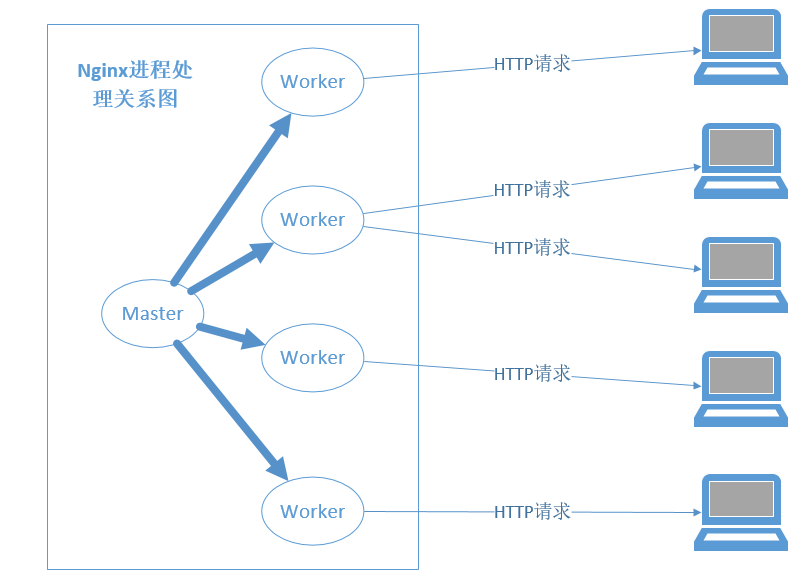

<!--
author: checkking
date: 2017-02-13
title: Nginx学习笔记(一)
tags: nginx
category: nginx
status: publish
summary: nginx 学习笔记
-->
### 运行中的Nginx进程间的关系
在正式提供服务的产品环境下，部署nginx都是使用一个master进程来管理多个worker进程，
一般情况下，worker进程的数量与服务器上的CPU核心数相等。
每个worker进程都是繁忙的，他们真正提供互联网服务，master进程则很清闲，只负责监控管理
worker进程。
Nginx是支持单进程(master进程)提供服务的，那么为什么产品环境下要按照master-worker方式配置同时
启动多个进程呢？这样做的好处主要有以下两点：
- 由于master进程不会对用户请求提供服务，只用于管理真正提供服务的worker进程，所以master进程可以是唯一的，它仅专注于自己的纯管理工作，为管理员提供命令行服务，包括诸如启动服务、停止服务、重载配置文件、平滑升级程序等。master进程需要拥有较大的权限，例如，通常会利用root用户启动master进程。worker进程的权限要小于或等于master进程，这样master进程才可以完全地管理worker进程。当任意一个worker进程出现错误从而导致coredump时，master进程会立刻启动新的worker进程继续服务。
- 多个worker进程处理互联网请求不但可以提高服务的健壮性（一个worker进程出错后，其他worker进程仍然可以正常提供服务），最重要的是，这样可以充分利用现在常见的SMP多核架构，从而实现微观上真正的多核并发处理。因此，用一个进程（master进程）来处理互联网请求肯定是不合适的。另外，为什么要把worker进程数量设置得与CPU核心数量一致呢？这正是Nginx与Apache服务器的不同之处。在Apache上每个进程在一个时刻只处理一个请求，因此，如果希望Web服务器拥有并发处理的请求数更多，就要把Apache的进程或线程数设置得更多，通常会达到一台服务器拥有几百个工作进程，这样大量的进程间切换将带来无谓的系统资源消耗。而Nginx则不然，一个worker进程可以同时处理的请求数只受限于内存大小，而且在架构设计上，不同的worker进程之间处理并发请求时几乎没有同步锁的限制，worker进程通常不会进入睡眠状态，因此，当Nginx上的进程数与CPU核心数相等时（最好每一个worker进程都绑定特定的CPU核心），进程间切换的代价是最小的。

