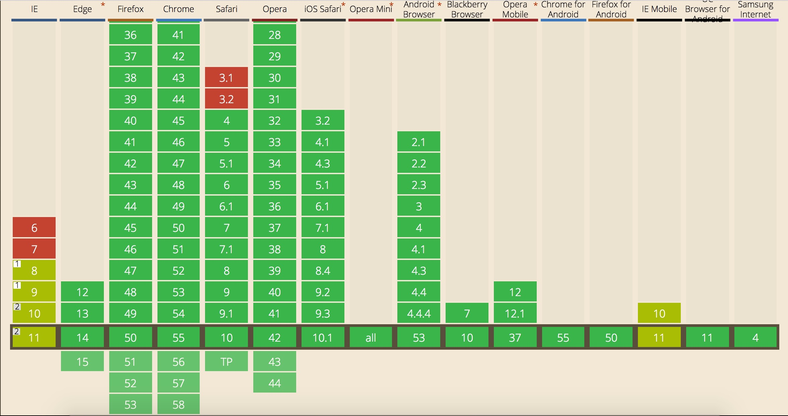

<!--
author: checkking
date: 2017-02-14
title: javascript跨域问题
tags: javascript
category: javascript
status: publish
summary: 谈谈javascript跨域
-->
### 什么是js跨域通信？
跨域问题，是指在一个域下的页面中通过js访问另一个不同域下的数据对象，出于安全性考虑，几乎所有浏览器都不允许这种跨域访问，这就导致在一些ajax应用中，使用跨域的web service会成为一个问题。

浏览器中有个重要的安全措施：同源策略。现在所有javascript浏览器都支持这个策略。

同源策略：简单说就是要求动态内容（例如，Javascript或者VBScript）只能阅读与之同源的那些HTTP应答和cookies, 而不能读来自不同源的内容。但是，同源策略对写操作没有任何限制。因而，一个web站点可以向任何其他的web站点发送HTTP请求.

#### 什么是相同域？
相同域 = 相同的协议 + 相同的端口 + 相同的域名

例如：http://www.example.com/index.html 和 http://www.example.com/search/1.html 是同域;https://www.baidu.com 和 http://www.baidu.com属于跨域.

### 为什么要有同源限制？
我们举一个例子说明：比如一个黑客程序，他利用IFrame把真正的银行登录页面嵌入到他的页面，当你使用真实的用户名，密码登录时，它可以通过javascript读取到你的表单中的input中的内容. 因此要加以限制。

### js跨域通信的方法
#### document.domain
- 关键点
   1. 跨域分为两种，一种xhr不能访问不同源的文档，另一种是不同window之间不能进行交互操作;
   2. document.domain主要是解决第二种情况，且只能适用于主域相同子域不同的情况；
   3. document.domain的设置是有限制的，我们只能把document.domain设置成自身或更高一级的父域，且主域必须相同。例如：a.b.example.com中某个文档的document.domain可以设成a.b.example.com、b.example.com 、example.com中的任意一个，但是不可以设成c.a.b.example.com，因为这是当前域的子域，也不可以设成baidu.com，因为主域已经不相同了。
- 兼容性：所有浏览器都支持；
- 优点：
    1. 可以实现不同window之间的相互访问和操作；
- 缺点：
    1. 只适用于父子window之间的通信，不能用于xhr；
    2. 只能在主域相同且子域不同的情况下使用；
- 使用方式:
    1. a（当前页面或父页面）页面中加入document.domain = ‘example.com’;
    2. b（当前页面或子页面）页面中加入document.domain = ‘example.com’;
    3. a页面访问b页面里面的数据或者方法；

#### window.name
- 关键点：window.name在页面的生命周期里共享一个window.name;
- 兼容性：所有浏览器都支持；
- 优点：
    1. 最简单的利用了浏览器的特性来做到不同域之间的数据传递；
    2. 不需要前端和后端的特殊配制；
- 缺点：
    1. 大小限制：window.name最大size是2M左右，不同浏览器中会有不同约定；
    2. 安全性：当前页面所有window都可以修改，很不安全；
    3. 数据类型：传递数据只能限于字符串，如果是对象或者其他会自动被转化为字符串，如下；
- 使用方式：修改window.name的值即可；

#### jsonp
- 关键点：浏览器对XHR做了同源策略，但并没有将这种方式延续到script上（其实还有iframe，img等），从而可以利用动态script标签技术来做到跨域请求的作用。至于为什么会这样设计，本人也不太清楚，有可能是历史遗迹（漏洞），有可能是某些方面的技术瓶颈，也有可能是为了满足某些需求专门定制的，总之这项技术方案我们过去可以用，现在可以用就ok，至于将来应该也是会存在的，毕竟现在已经应用在很多家站点上，就算会废弃，也会有一段时间迭代。
- 兼容性：所有浏览器都兼容这种方式；
- 优点：很明显前端可以很轻松的做到跨域请求；
- 缺点
    1. 只能通过GET方式请求，一方面是参数长度有限制，二是安全性比较差；
    2. 后端需要知道前端的cb是什么样的结构，主要在参数和回调名；
    3. 后端需要进行参数和cb的拼接然后才能执行；
- 使用方式:
```javascript
/** 前端生成script标签，并将src中传入需要执行的callback **/
<script type="text/javascript">
    var ele = document.createElement('script');
    ele.type = "text/javascript"
    ele.src = "http://example.com?jsonp=cb";
    document.body.appendChild(ele);
</script>
/** 后端接到参数后给callback加入参数并执行 **/
<?php
    $cb = $_GET['cb'];
    $data = array('test1', 'test2', 'test3');
    echo $cb.'('.json_encode($data).')';
?>
```

#### postMessage
- 关键点：postMessage是h5引入的一个新概念，现在也在进一步的推广和发展中，他进行了一系列的封装，我们可以通过window.postMessage的方式进行使用，并可以监听其发送的消息；
- 兼容性：下图是postMessage的兼容图，移动端可以放心用，但是pc端需要做降级处理，具体可以根据文中介绍的这几种跨域方式来则情选择；


- 优点
    1. 不需要后端介入就可以非常简单的的做到跨域，一个函数外加两个参数（请求url，发送数据）就可以搞定；
    2. 移动端兼容性好；
- 缺点
    1. 无法做到一对一的传递方式：监听中需要做很多消息的识别，由于postMessage发出的消息对于同一个页面的不同功能相当于一个广播的过程，该页面的所有onmessage都会收到，所以需要做消息的判断；
    2. 安全性问题：三方可以通过截获，注入html或者脚本的形式监听到消息，从而能够做到篡改的效果，所以在postMessage和onmessage中一定要做好这方面的限制；
    3. 发送的数据会通过[结构化克隆算法](https://developer.mozilla.org/en-US/docs/Web/API/Web_Workers_API/Structured_clone_algorithm)进行序列化，所以只有满足该算法要求的参数才能够被解析，否则会报错，如function就不能当作参数进行传递；
- 使用方式：下面是前段时间写的一个通信的函数，sendMessage负责发送消息，bindEvent负责消息的监听并处理，可以通过代码来做一个大致了解；
```javascript
Storage.prototype.sendMessage_ = function(type, params, fn) {
    if (this.topWindow) {
        this.handleCookie_(type, params, fn);
        return;
    }
    var eventId = this.addToQueue_(fn, type);
    var storageIframe = document.getElementById('mip-storage-iframe');
    var element = document.createElement("a");
    element.href = this.origin;
    var origin = element.href.slice(0, element.href.indexOf(element.pathname) + 1);
    storageIframe.contentWindow.postMessage({
type: type,
params: params,
eventId: eventId
}, origin);
}
Storage.prototype.bindEvent_ = function() {
    window.onmessage = function (res) {
        // 判断消息来源
        if (window == res.source.window.parent &&
                res.data.type === this.messageType.RES &&
                window.location.href.match(res.origin.host).length > 0) {
            var fn = this.eventQueue[res.data.eventId];
            fn && fn();
            delete this.eventQueue[res.data.eventId];
            // reset id
            var isEmpty = true;
            for (var t in this.eventQueue) {
                isEmpty = false;
            }
            if (isEmpty) {
                this.id = 0;
            }
        }
    }.bind(this);
}
```

