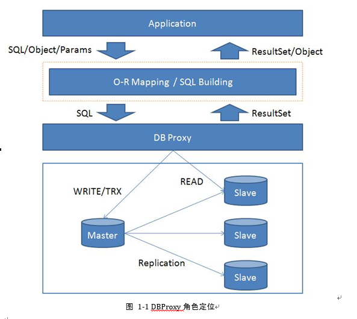
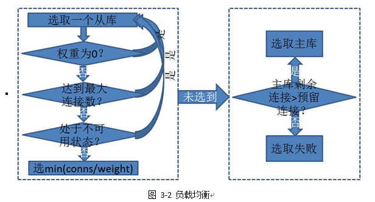
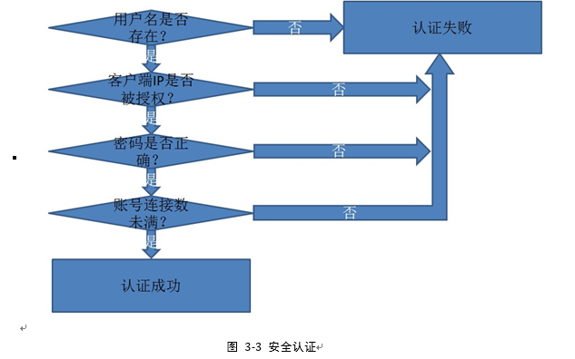

<!--
author: checkking
date: 2017-02-26
title: 谈谈DBProxy
tags: mysql
category: mysql
status: publish
summary: 介绍下dbproxy
-->

### DBProxy背景
实际项目中，读写分离，失败重连，负载均衡，连接池等功能往往写在应用中，不仅干扰了实际应用的代码，还使应用出错的机会大大增加，而SQL日志分析，连接池等功能在php上更是很难做或者根本做不了。在应用中为数据库开发的上述功能，重用性较低，换成另外的项目或开发环境基本上就不能使用或者需要修改原来运用的代码，使得应用代码耦合了数据库封装的API。为了为应用提供独立透明的高性能服务并尽可能保证代码的通用性以及减少代码的变动代价。
### DBProxy的角色
DBProxy 位于Application与数据库之间，为应用提供透明的代理服务。
DBProxy 对外接口采用 mysql protocol，没有定义自己的协议和接口，使得任何mysql的应用都能方便的使用DBProxy。
DBProxy 没有Build 任何 SQL语句，而是直接接收client的SQL、命令等进行代理转发，DBProxy 采用 SQL、命令等 mysql protocol规范作为统一的接口，完备性得到了保证，能够完成mysql的所有功能操作。如果需要SQL Building或者O-R Mapping，可以在 DBProxy上再开发一层 SQL Building/O-R Mapping, 以丰富实际的应用，由于DBProxy没有耦合任何东西，所以这一点能够方便地实现。

### DBProxy实现的功能
#### 读写分离
为应用提供读写分离服务，读请求走从库，写请求走主库。
判断读写请求的方法如下：
以select、show、use、explain、desc、set（不包括set auto_commit=0）等开头的，确定不会修改数据的sql，判断为读请求。
非读请求的sql均判断为写请求，包括事务。

读写分离的具体策略如下:
1. 基本原则是读请求发送到从库，写请求发送到主库;
2. 为了避免主从延迟带来的读不到刚刚更新的数据的问题，同一会话中，写请求结束后指定时间内的读请求也发到主库，此时间可配，参见第4.1.21节提到的write_time_interval参数说明。如果此时间内没有新的写请求，则会话回到从库;
3. 事务内的sql不进行读写分离，全部发到主库;
4. DBProxy会缓存影响会话状态的sql命令，当同一个客户端会话对应的mysql切换时，会在切换后的mysql上回放这些缓存的sql命令，以保证客户端会话的一致性。影响会话状态的sql包括use命令和set命令。

#### 负载均衡
负载均衡的主要作用是使各DB服务器的负载大致相当。DBProxy可通过各DB的当前连接数，请求时间，重连次数，DB系统状态(status,variables等)，DB机器状态等情况选择当前请求选择的连接。

如上图所示，当前负载均衡的策略是：
1. 基本原则是在所有备选DB服务器中选择当前连接数/权重系数最小的进行连接;
2. 如果总权重大于0，且当前DB服务器的权重等于0，则跳过此DB服务器;
3. 如果当前DB服务器达到了最大连接数上限，则跳过此DB服务器;
4.如果上次负载均衡时发现某DB服务器不可用（网络不通或达到最大连接数等原因），且距离当前时间不超过指定时间，则DBProxy认为此服务器依然不可用，跳过此服务器。此时间可配;
5. 如果备选库是主库，且当前DB服务器的剩余连接数不大于预留连接数，则跳过此服务器。预留连接数可配;
6. 如果备选库是从库，但所有从库都不可用，则把备选库改为主库，重新执行以上策略。

备选DB服务器是读写分离策略确定的，如果sql要被发往主库，备选DB服务器就是所有主库服务器，否则就是所有从库服务器。权重系数可配.

#### 安全认证
DBProxy使用IP和账号密码进行访问控制, DBProxy使用独立的访问账号，与DB服务器的账号分离, DBProxy和DB服务器的帐号密码均在DBProxy的配置文件中配置。

如上图所示，一个新连接到来时，DBProxy首先检查用户名是否存在，如果存在，检查客户端IP是否在授权列表中，如果是，检查密码是否正确，如果正确，检查当前用户的连接数是否达到上限，如果没有，则认证成功，否则，一旦上述4个条件有任何一个不符合，就会认证失败。

#### 失败重连
失败重连主要是为应用到DB服务器建立重连机制，此处的“失败”是指TCP层的连接失败，而非应用层的连接失败，如达到最大连接数、密码错误等不会重连。
连接失败后会重试，最多重试2次（算上第一次一共3次）。如果3次之内连接成功，客户端不会感知到有失败现象，如果3次都失败，DBProxy把此库暂时标记为不可用状态，然后重新执行负载均衡的策略选择一台DB服务器进行连接。
如果执行完上述策略后仍未获得数据库连接，则关闭客户端连接。
造成这种情况的原因可能是多个数据库主机的确不能连接或者数据库连接达到上限或者DBProxy配置的最大连接数达到上限等情况。

#### 连接池
客户端连接关闭时，DBProxy检查到DB服务器的连接是否可重用，如果不可重用，则断开连接，如果可重用，则并不断开到DB服务器的连接，而是把连接放到连接池，下次客户端再连接DBProxy时，DBProxy从连接池中获取一个连接给客户端使用。如果连接池中没有可用的连接，则建立新连接。
连接池分为两类：读连接池和写连接池，从连接池中获取连接时，根据读写分离的策略确定从哪一类连接池中获取。
某些条件下的连接不可重用，这些条件包括：
1. 请求处理过程中断开的连接;
2. 处在事务中未提交且未回滚就断开的连接;
3. 复用次数达到上限的连接;
4. 执行过set、prepare、存储过程语句的连接。

连接池中的连接被复用也是有条件的: db_username相同，使用的数据库名字相同。如果连接池中的连接超过一定时间没有被复用，则释放该连接。

#### 配置热加载
DBProxy的运行依赖配置文件，当配置文件有更新时，DBProxy会重新解析和加载配置文件，更新自己的配置。

#### 参考
1. [美团点评数据库中间件DBProxy开源](http://tech.meituan.com/dbproxy-pr.html)
2. [DBProxy](https://github.com/Meituan-Dianping/DBProxy)
