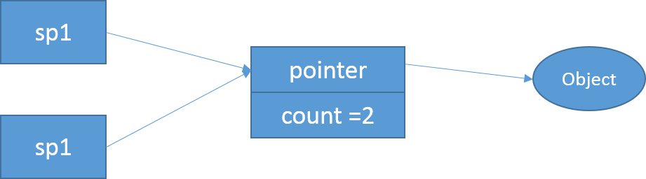
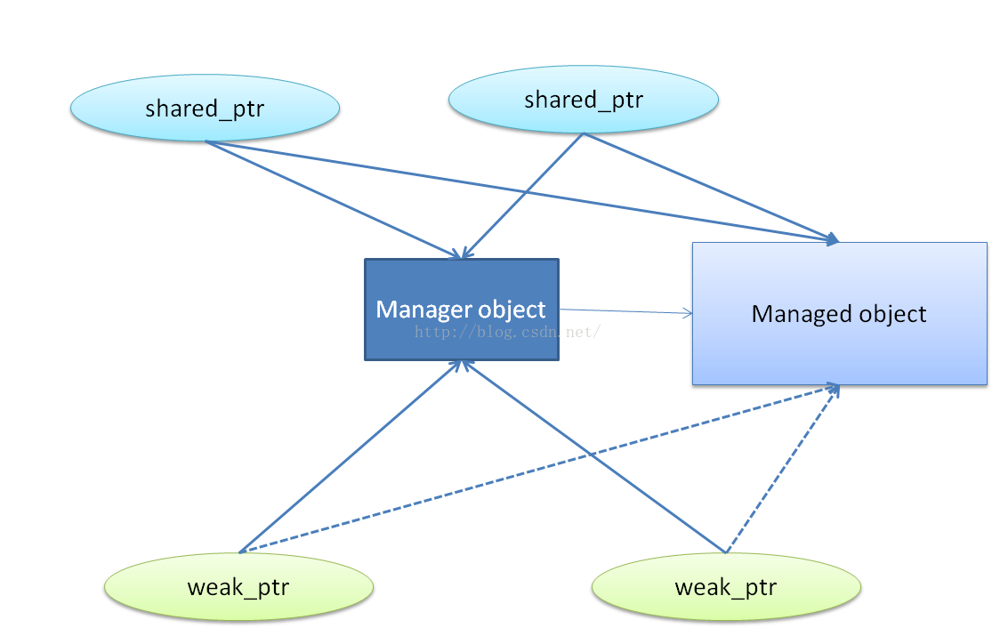

<!--
author: checkking
date: 2017-03-04
title: 线程安全的对象生命周期管理
tags: C/C++
category: C/C++
status: publish
summary: 总结一下C++对象生命周期管理
-->
### 对象销毁不容易
对一般成员函数而言，做到线程安全的办法是让他们顺次执行，而不要并发执行（不要同时读写共享状态），也就是让每个成员函数的临界区不重叠。不过这里有一个隐含条件：成员函数用来保护临界区的互斥器本身是有效的。而析构函数破坏了这一假设，它会把mutex成员变量销毁掉。请看下面的例子：
```cpp
Foo::~Foo() {
    MutexLockGuard lock(_mutex);
    // free internal state            (1)
}
```
```cpp
void Foo::update() {
    MutexLocakGuard lock(_mutex);           // (2)
    // make use of internal state
}
```
此时，有A,B两个线程都能看到Foo对象x, 线程A即将销毁x，而线程B正准备调用x->update().

```cpp
extern Foo* x;     // visibale by all threads
// thread A
delete x;
x = NULL;


// thread B
if (x) {
    x->update();
}
```
这里有一个race condition:

1. 线程执行到(1)处，已经持有了互斥锁，即将继续往下执行。
2. 线程B通过了if(x)检查（此时x被销毁，但还没有执行x=NULL），接着阻塞在(2)处。

接下来会发生什么是不确定的，因为析构函数会把_mutex销毁，那么(2)处有可能永远阻塞下去，有可能进入临界区，然后core dump，或更糟糕的情况。

这个例子说明，作为class的数据成员MutexLock只能同步本class的其他数据成员的读写，他不能保护安全地析构。因为MutexLock成员的生命周期最多和本class一样长，而析构函数可说是发生在对象身故之后。

另外，如果要同时读写一个class的两个对象，有潜在的死锁可能。比如说有swap这个函数：
```cpp
void swap(Conter& a, Counter& b) {
    MutexLockGuard aLock(a._mutex);
    MutexLockGuard bLock(b._mutex);
    int64_t value = a._value;
    a._value = b._value;
    b._value = value;
}
```
如果线程A执行swap(a, b); 而同时线程B执行swap(b,a)，就有可能发生死锁。

一个函数如果要锁住相同类型的多个对象，为了保证始终按相同的顺序加锁，我们可以比较mutex对象的地址，始终加锁地址较小的mutex。

### 原始指针的问题
#### 空悬指针
有两个指针p1和p2, 指向堆上的同一个对象Object，p1和p2位于不同的线程中，假设线程A通过p1指针将对象销毁了，那么p2就变成空悬指针了。


要想安全地销毁对象，最好在别人（线程）都看不到的情况下，偷偷去做。这正是垃圾回收的原理，所有人都看不到的东西一定是垃圾。

#### 一个解决办法
一个解决空悬指针的办法是，引入一层间接性，让p1和p2所指的对象永久有效。如图proxy对象。当销毁Object之后，proxy对象继续存在，其值变为0。而p2也没有变成空悬指针，它可以通过查看proxy的内容来判断Object是否还活着。


要线程安全得释放Object不是那么容易，race condition依旧存在。比如p2看到第一眼的时候proxy不是0，正准备去调用Object的成员函数，期间对象已经被p1给销毁了。


为题在于，何时释放proxy指针呢？

#### 一个更好的办法
为了安全地释放proxy，我们可以引入引用计数(refernce counting)。

- 一开始，有两个引用，计数值为2



- sp1析构了，引用计数的值减为1


- sp2也析构了，引用计数降为0，可以安全地销毁proxy和Object了


这正是引用计数类型的智能指针的做法。

### 神器shared_ptr/weak_ptr
- shared_ptr共享被管理对象，同一时刻可以有多个shared_ptr拥有对象的所有权，当最后一个shared_ptr对象销毁时，被管理对象自动销毁。
- weak_ptr不拥有对象的所有权，但是它可以判断对象是否存在和返回指向对象的shared_ptr类型指针；它的用途之一是解决了多个对象内部含有shared_ptr循环指向，导致对象无法释放的问题。
通过阅读[gcc相关源码](https://github.com/gcc-mirror/gcc/blob/master/libstdc%2B%2B-v3/include/tr1/shared_ptr.h)，可以画出类的关系图如下：


从上面的类图可以清楚的看出shared_ptr内部含有一个指向被管理对象(managed object)T的指针以及一个__shared_count对象，__shared_count对象包含一个指向管理对象(manager object)的基类指针，管理对象(manager object)由具有原子属性的use_count和weak_count、指向被管理对象(managed object)T的指针、以及用来销毁被管理对象的deleter组成，以下均将用new创建后托管给shared_ptr等智能指针的对象叫做被管理对象（managed object)；shared_ptr等智能指针内部创建的用来维护被管理对象生命周期的实例叫做管理对象(manager object)：


weak_ptr内部组成与shared_ptr类似，内部同样含有一个指向被管理对象T的指针以及一个__weak_count对象：


shared_ptr与weak_ptr的差异主要是由__shared_ptr与__weak_ptr体现出来的，而__shared_ptr与__weak_ptr的差异则主要是由__shared_count与__weak_count体现出来。


通过shared_ptr的构造函数，可以发现，在创建一个shared_ptr的时候需要一个new 操作符返回被管理对象的地址来初始化shared_ptr, shared_ptr在内部会构建一个_shared_count对象，由_shared_count对象的构造函数可知，创建shared_ptr的时候也动态的创建了一个管理对象_Sp_counted_base_impl:

```cpp
template<typename _Tp1> explicit __shared_ptr(_Tp1* __p)
: _M_ptr(__p), _M_refcount(__p) {
    __glibcxx_function_requires(_ConvertibleConcept<_Tp1*, _Tp*>)
    typedef int _IsComplete[sizeof(_Tp1)];
    __enable_shared_from_this_helper(_M_refcount, __p, __p);
}

template<typename _Ptr>
__shared_count(_Ptr __p) : _M_pi(0)
{
    __try
   {
	  typedef typename std::tr1::remove_pointer<_Ptr>::type _Tp;
	  _M_pi = new _Sp_counted_base_impl<_Ptr, _Sp_deleter<_Tp>, _Lp>(__p, _Sp_deleter<_Tp>());
    }
    __catch(...)
    {
        delete __p;
	__throw_exception_again;
    }
}
```

`shared_ptr`内部包含一个指向被管理对象的指针`_M_ptr`, `_Sp_counted_base_impl`内部也含有一个指向被管理对象的指针`_M_ptr`， 它们是不是重复多余了呢？实际上不多余，它们有各自的功能。这首先要从`shared_ptr`的拷贝构造或者赋值构造说起，当一个`shared_ptr`对象`sp2`是由`sp1`拷贝构造或者赋值构造得来的时候，实际上构造完成后`sp1`内部的`__shared_count`对象包含的指向管理对象的指针与`sp2`内部的`__shared_count`对象包含的指向管理对象的指针是相等的，也就是说当多个`shared_ptr`对象来管理同一个对象时，它们共同使用同一个动态分配的管理对象。这可以从下面的`__share_ptr`的构造函数和`__shared_count`的构造函数清楚的看出。

```cpp
template<typename _Tp1>
 __shared_ptr(const __shared_ptr<_Tp1, _Lp>& __r)
 : _M_ptr(__r._M_ptr), _M_refcount(__r._M_refcount) // never throws
{__glibcxx_function_requires(_ConvertibleConcept<_Tp1*, _Tp*>)}


__shared_count&
operator=(const __shared_count& __r) // nothrow
{
    _Sp_counted_base<_Lp>* __tmp = __r._M_pi;
    if (__tmp != _M_pi)
    {
        if (__tmp != 0)
            __tmp->_M_add_ref_copy();
	if (_M_pi != 0)
	    _M_pi->_M_release();
	
        _M_pi = __tmp;
    }
}
```
`__shared_count`内部的`use_count`主要用来标记被管理对象的生命周期，`weak_count`主要用来标记管理对象的生命周期。

当一个`shared_ptr`超出作用域被销毁时，它会调用其`_share_count`的`_M_release()`对`use_count`和`weak_count`进行自减并判断是否需要释放管理对象和被管理对象，这是RAII原理的核心体现：
```cpp
~__shared_count() // nothrow
 {
	 if (_M_pi != 0)
	  _M_pi->_M_release();
 }
```
对于`weak_ptr`, 其对应的`__weak_count`的拷贝构造函数如下:
```cpp
//************_Sp_counted_base*****************//
 void
 _M_weak_add_ref() // nothrow
{ __gnu_cxx::__atomic_add_dispatch(&_M_weak_count, 1); }

//************_Sp_counted_base*****************//
void
_M_weak_release() // nothrow
{
    // Be race-detector-friendly. For more info see bits/c++config.
    _GLIBCXX_SYNCHRONIZATION_HAPPENS_BEFORE(&_M_weak_count);
    if (__gnu_cxx::__exchange_and_add_dispatch(&_M_weak_count, -1) == 1)
    {
        _GLIBCXX_SYNCHRONIZATION_HAPPENS_AFTER(&_M_weak_count);
	if (_Mutex_base<_Lp>::_S_need_barriers)
	{
	    // See _M_release(),
	    // destroy() must observe results of dispose()
            __atomic_thread_fence (__ATOMIC_ACQ_REL);
	}
	_M_destroy();
    }
}
 
__weak_count<_Lp>&
operator=(const __shared_count<_Lp>& __r) // nothrow
{
    _Sp_counted_base<_Lp>* __tmp = __r._M_pi;
    if (__tmp != 0)
        __tmp->_M_weak_add_ref();
  
    if (_M_pi != 0)
        _M_pi->_M_weak_release();
  
    _M_pi = __tmp;  
	
    return *this;
}
      
__weak_count<_Lp>&
operator=(const __weak_count<_Lp>& __r) // nothrow
{
    _Sp_counted_base<_Lp>* __tmp = __r._M_pi;
    if (__tmp != 0)
        __tmp->_M_weak_add_ref();
    if (_M_pi != 0)
        _M_pi->_M_weak_release();
    _M_pi = __tmp;
	
    return *this;
}

__weak_count<_Lp>&
operator=(const __shared_count<_Lp>& __r) // nothrow
{
    _Sp_counted_base<_Lp>* __tmp = __r._M_pi;
    if (__tmp != 0)
      __tmp->_M_weak_add_ref();
    if (_M_pi != 0)
      _M_pi->_M_weak_release();
    _M_pi = __tmp;  
    return *this;
}

~__weak_count() // nothrow
{
    if (_M_pi != 0)
        _M_pi->_M_weak_release();
}
```
从上面可以看出:

`__weak_count`相关的赋值拷贝以及析构函数均只会影响到`weak_count`的值，对`use_count`没有影响；当`weak_count`为0时，释放管理对象。也就是说`__weak_ptr`不影响被管理对象的生命周期。同时由于`__weak_ptr`没有像`__shared_ptr`那样实现`*`，`->`等常见指针相关操作符，`__weak_ptr`不能直接操作被管理对象；
`__weak_count`自身间的赋值以及`__shared_count`对`__weak_count`的赋值时，它们都具有同样的指向管理对象的指针；也就是说当多个`__weak_ptr`和`__shared_ptr`指向同一个被管理对象时，它们共享同一个管理对象，这就保证了可以通过`__weak_ptr`可以判断`__shared_ptr`指向的被管理对象是否存在以及获取到被管理对象的指针。
`__shared_ptr`与`__weak_ptr`在管理同一对象时，它们间的关系如下图所示：



由于`weak_ptr`不能直接操作被管理对象但其仍然持有指向被管理对象的指针（用来初始化内部的`__weak_count`对象），`weak_ptr`与被管理对象用虚线联接。
`_weak_ptr`有几个重要的成员函数：通过`expired()`方法来判断对象是否过期（已经被释放）；通过`use_count()`方法返回目前有多少个`__shared_ptr`对象指向被管理对象；通过`lock()`方法返回一个指向被管理对象的`__shared_ptr`指针，调用者可以通过这个`__shared_ptr`指针来操纵被管理对象而不用担心资源泄漏。

```cpp
/*************_weak_ptr*************************/
long
use_count() const // never throws
{ return _M_refcount._M_get_use_count(); }

bool
expired() const // never throws
{ return _M_refcount._M_get_use_count() == 0; }

__shared_ptr<_Tp, _Lp>
lock() const // never throws
{
#ifdef __GTHREADS
       // Optimization: avoid throw overhead.
    if (expired())
              return __shared_ptr<element_type, _Lp>();

    __try
    {
            return __shared_ptr<element_type, _Lp>(*this);
    }
    __catch(const bad_weak_ptr&)
    {
        // Q: How can we get here?
       // A: Another thread may have invalidated r after the
       //    use_count test above.
       return __shared_ptr<element_type, _Lp>();
     }
    
#else
    // Optimization: avoid try/catch overhead when single threaded.
    return expired() ? __shared_ptr<element_type, _Lp>()
                     : __shared_ptr<element_type, _Lp>(*this);

#endif
} // XXX MT
```

当然`shared_ptr`也不是万能的，使用的时候也要注意到它给程序员挖的一个大坑：`shared_ptr`能够管理对象的生命周期，负责对象资源释放，其前提条件是所有`shared_ptr`共用同一个管理对象。如果多个`shared_ptr`使用多个管理对象来管理同一个被管理对象，这些管理对象在`use_count`为0时均会释放被管理对象，将会造成多个管理对象多次释放被管理对象，造成twice delete的堆错误。下面的例子在单独使用裸指针的时候没有问题，采用`shared_ptr`将会出现twice delete的问题：
```cpp
class Thing {
public:
	void foo();
	void defrangulate();
};
void transmogrify(Thing *);
int main()
{
	Thing * t1 = new Thing;
	t1->foo();
	...
	delete t1; // done with the object
}
...
void Thing::foo()
{
	// we need to transmogrify this object
	transmogrify(this);
}
void transmogrify(Thing * ptr)
{
	ptr->defrangulate();
	/* etc. */
}
//***** Use shared_ptr***************************//
class Thing {
public:
	void foo();
	void defrangulate();
};
void transmogrify(shared_ptr<Thing>);
int main()
{
	shared_ptr<Thing> t1(new Thing); // create manager object A for the Thing
	t1->foo();
	...
	// Thing is supposed to get deleted when t1 goes out of scope
}
void Thing::foo()
{
	// we need to transmogrify this object
	shared_ptr<Thing> sp_for_this(this); //  create manager object B for the Thing
	transmogrify(sp_for_this);
	
	// Thing is supposed to get deleted when sp_for_this and other shared_ptr goes out of scope
}
void transmogrify(shared_ptr<Thing> ptr)
{
	ptr->defrangulate();
	/* etc. */
}
```
上面注释处分别创建了两个`shared_ptr`指针`t1`，`sp_for_this`, 它们各自有自己的管理对象，但被管理的堆内存却是一样的，这就导致在`t1`和`sp_for_this`析构时，它们各自的管理对象均会析构被管理对象，造成twice delete。

怎样解决上面这一广泛存在问题：当一个对象M创建后，如果一个函数f（另一个类的成员函数或是其它自由函数）的形参为M类型的智能指针，如何在对象M内部将对象M的指针作为实参传递给该函数f ? C++引入了`enable_shared_from_this`利用`weak_ptr`的特性解决了这一问题。其基本思想是通过M继承模板类`enable_shared_from_this`，这样对象M内部将会有一个`__weak_ptr`指针`_M_weak_this`，在第一次创建指向M的`shared_ptr Pt`时，通过模板特化，将会初始化`_M_weak_this`;这样M内部也会产生一个指向自身的`weak_ptr`，并且该`weak_ptr`内部的管理对象与Pt的管理对象是相同的（这可以从`weak_ptr`内部的`_M_assign`函数看出）。

上面示例中改写后的正确代码为：
```cpp
class Thing : public enable_shared_from_this<Thing> {
public:
	void foo();
	void defrangulate();
};
int main()
{
	// The following starts a manager object for the Thing and also
	// initializes the weak_ptr member that is now part of the Thing and share same manager object.
	shared_ptr<Thing> t1(new Thing);
	t1->foo();
	...
}
void Thing::foo()
{
	// get a shared_ptr from the weak_ptr in this object
	shared_ptr<Thing> sp_this = shared_from_this();
	transmogrify(sp_this);
}
void transmogrify(shared_ptr<Thing> ptr)
{
	ptr->defrangulate();
	/* etc. */
}
```
解决了所有的坑，`shared_ptr`是不是就十全十美了呢？当然不是，`shared_ptr`也存在不足：在采用`shared_ptr<M> p(new M);`形式创建`p`来管理`M`时，我们实际发现这中间有两次的动态内存分配：一次为创建被管理对象M，一次为创建管理对象；而内存分配通常是比较昂贵的操作。

如果频繁的需要创建指向多个不同对象的智能指针，可以采用`shared_ptr<M> p(make_shared<M>);`的方式，采用这种方式系统将会分配一大块内存同时存放管理对象和被管理对象，这就避免了上面所说的二次内存分配的问题，同时程序中也不会出现`new`操作符，符合"no naked new!"的编程倡导。当然这也有缺点，如果所有指向该对象的智能指针都销毁了，尽管对象的析构函数会被调用，析构被管理对象，但是如果还有`weak_ptr`指向该块对象所在的内存，存放管理对象的部分内存仍将不会被释放，因而导致在所有其他`weak_ptr`销毁前整块内存（尽管被管理对象已经析构了）将不会进入系统的内存池循环使用。

有了上面的这些知识，可以写一个完整的SotokFactory，代码如下：
```cpp
class StockFactory : public boost::enable_shared_from_this<StockFactory>,
                       boost::noncopyable
{
 public:
  shared_ptr<Stock> get(const string& key)
  {
    shared_ptr<Stock> pStock;
    MutexLock lock(mutex_);
    weak_ptr<Stock>& wkStock = stocks_[key];
    pStock = wkStock.lock();
    if (!pStock) {
      pStock.reset(new Stock(key),
                   boost::bind(&StockFactory::weakDeleteCallback,
                               boost::weak_ptr<StockFactory>(shared_from_this()),
                               _1));
      // 上面必须强制把 shared_from_this() 转型为 weak_ptr，才不会延长生命期
       wkStock = pStock;
    }
    return pStock;
  }
private:
  static void weakDeleteCallback(boost::weak_ptr<StockFactory> wkFactory,
                                 Stock* stock)
  {
    shared_ptr<StockFactory> factory(wkFactory.lock());
    if (factory) {  // 如果 factory 还在，那就清理 stocks_
      factory->removeStock(stock);
    }
    delete stock;  // sorry, I lied
  }
  void removeStock(Stock* stock) 
  {
    if (stock) {
      MutexLock lock(mutex_);
      stocks_.erase(stock->key());
    }
  }
 private:
  std::map<string, weak_ptr<Stock> > stocks_;
  mutable Mutex mutex_;
};


void testLongLifeFactory()
{
  shared_ptr<StockFactory> factory(new StockFactory);
  {
    shared_ptr<Stock> stock = factory->get("NYSE:IBM");
    shared_ptr<Stock> stock2 = factory->get("NYSE:IBM");
    assert(stock == stock2);
    // stock destructs here
  }
  // factory destructs here
}
void testShortLifeFactory()
{
  shared_ptr<Stock> stock;
  {
    shared_ptr<StockFactory> factory(new StockFactory);
    stock = factory->get("NYSE:IBM");
    shared_ptr<Stock> stock2 = factory->get("NYSE:IBM");
    assert(stock == stock2);
    // factory destructs here
  }
  // stock destructs here
}
```

#### 参考资料
1. 《Linux 多线程服务端编程》(陈硕)
2. [C++ 智能指针（shared_ptr/weak_ptr）源码分析](http://lib.csdn.net/article/cplusplus/22038)


