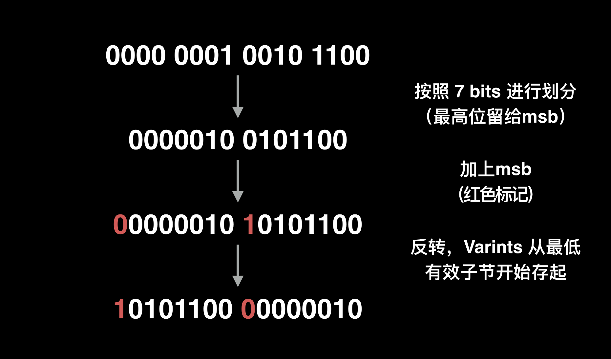
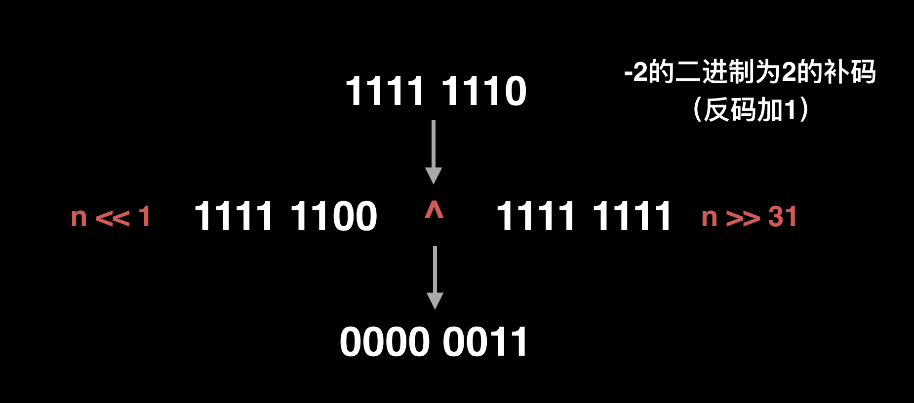

<!--
author: checkking
date: 2017-03-19
title: Google Protobuffer编码
tags: protobuffer
category: protobuffer
status: publish
summary: Google Protobuffer编码笔记
-->
### Base 128 Varints
官方描述：Each byte in a varint, except the last byte, has the most significant bit (msb) set – this indicates that there are further bytes to come. The lower 7 bits of each byte are used to store the two's complement representation of the number in groups of 7 bits, **least significant group first**.
也就是：

1. 除了最后一个字节，varint中的每个字节的最高位设为1，表示后面还有字节出现
2. 每个字节的低7位看成是一个组（group），这个组和他相邻的下一个7位组共同存储某个整形的“组合表示”，最低有效组在前面。

例子：
1. 一个字节。下面只有一个字节，所以最高位是0，表示十进制1
```bash
0000 0001
```

2. 两个字节
```bash
1010 1100 0000 0010
```
由于第一个字节后面还有一个字节，所以第一个字节的最高位设置为1，表示后面还有后继字节，第二个字节的最高位为0。去掉每个字节的最高位，我们对两个字节进行分组。第一个7位组：0101100，第二个7位组：0000010，组合起来就是：0101100 0000010。
由于protobuffer采用小端字节序([关于字节序](https://en.wikipedia.org/wiki/Endianness))，也就是数据的低位保存在内存的低地址中，调整为`0101100 0000010`, 十进制为`2^8 + 2^5 + 2^3 + 2^2 = 300`

300 的二进制表示为 100101100，通过 Varint 编码后的二进制表示为 10101100 00000010，详细过程如下：


### message数据格式
比如我们定义了proto
```cpp
message Test1 {
  required int32 a = 1;
}
```
构造Test1对象，赋值a并且序列化到data
```cpp
    Test1 test;
    test.set_a(150);

    std::string data;
    test.SerializeToString(&data);
```
查看data:`08 96 01`.
可以看到相比xml/json等包装数据的方案，pb数据非常精简。

pb数据是一种[key, value]的数据格式，在序列化时也是如此，其中key使用的是该字段的field_number与wire type取|后的值。

field_number就是定义proto时使用的tag序号，比如对前面的proto字段a，对应的field_number=1。

wire type的取值有很多

|    Type    |    Meaning    |    Used For    |
|:----------:|:------------:|:---------------:|
|0           |    Varint    |int32, int64, uint32, uint64, sint32, sint64, bool, enum|
|1           |    64-bit   |    fixed64, sfixed64, double|
|2        |    Length-delimited|string, bytes, embedded messages, packed repeated fields|
|3|Start group|groups(deprecated)|
|4|End group|groups(deprecated)|
|5|32-bit|fixed32, sfixed32, float|

key的计算方式为(field_number << 3) | wire_type，即低位记录wire_type，高位记录field_number。
```cpp
// Number of bits in a tag which identify the wire type.
static const int kTagTypeBits = 3;

#define GOOGLE_PROTOBUF_WIRE_FORMAT_MAKE_TAG(FIELD_NUMBER, TYPE)                  \
  static_cast<uint32>(                                                   \
    ((FIELD_NUMBER) << ::google::protobuf::internal::WireFormatLite::kTagTypeBits) \
      | (TYPE))
```
然后再进行varint编码。
因此我们可以得到前面的例子里key为`varint(1 << 3 | 0) = 0x08`，value为`0x96 0x01`。

序列化key-value采用直接连接的方式，因此编码后的数据为`0x08 0x96 0x01`。

注意到varint编码也应用在了key的计算上，使用非常频繁，或许是基于这个原因，pb里实现了一种性能更高的方案（`coded_stream.cc`）。

```cpp
inline uint8* CodedOutputStream::WriteVarint32FallbackToArrayInline(
    uint32 value, uint8* target) {
  target[0] = static_cast<uint8>(value | 0x80);
  if (value >= (1 << 7)) {
    target[1] = static_cast<uint8>((value >>  7) | 0x80);
    if (value >= (1 << 14)) {
      target[2] = static_cast<uint8>((value >> 14) | 0x80);
      if (value >= (1 << 21)) {
        target[3] = static_cast<uint8>((value >> 21) | 0x80);
        if (value >= (1 << 28)) {
          target[4] = static_cast<uint8>(value >> 28);
          return target + 5;
        } else {
          target[3] &= 0x7F;
          return target + 4;
        }
      } else {
        target[2] &= 0x7F;
        return target + 3;
      }
    } else {
      target[1] &= 0x7F;
      return target + 2;
    }
  } else {
    target[0] &= 0x7F;
    return target + 1;
  }
}
```

### ZigZag
上节介绍了 Varints，我们知道 Varint 在处理小数值的数字很有效，而在处理值较大的数字则占用了多一个子节。对于负数来说，二进制最高有效位为 1，如果用 varint 来编码，无疑要占用比较多的子节。因此我们可以搭配 zigzag 来编码。

ZigZag 编码将有符整型转化成无符的整型，其原理是将最高位的符号位放到最低位（－1 除外），这样大大减少了字节占用。

举个例子，-2 的二进制表示为 1111 1110，用zigzag编码，－2 的绝对值为 2，二进制为 0000 0010，将符号位放到最低位，则变成 0000 0011。

公式如下：
- 32 位整型：(n << 1) ^ (n >> 31)
- 64 位整型：(n << 1) ^ (n >> 63)

> Note that the second shift – the (n >> 31) part – is an arithmetic shift. So, in other words, the result of the shift is either a number that is all zero bits (if n is positive) or all one bits (if n is negative).

注意这里的位移操作符。如果在位移运算符左边的变量是有符号数，编译产生的汇编指令是算术位移指令，如果该变量是无符号数，编译产生的汇编指令则是逻辑位移指令。对于左移，它们都一样，整个二进制右移，低位补 0；右移则有所区分，算数右移左边补最高符号位，逻辑位移左边补 0(如: -2, 对应的对应的二进制为1000 0010, 将最高位补在最右边就是0000 0011(3), 再比如，3的2进制为0000 0011, 最高位0补到最右边为0000 0110(6))。

举个例子，-2 经过 ZigZag 编码后为 3，过程如下：


| Signed Original | Encoded As |
|:---------------:|:----------:|
|0                |    0       |
|-1               |    	1      |
|1                |    2       |
|-2                |    3       |
|2               |    	4      |
|-3                |    5       |
|2147483647|4294967294|
|-2147483647|4294967294|

对应的编码及解码方案(wire_format_lite.h)
```cpp
inline uint32 WireFormatLite::ZigZagEncode32(int32 n) {
  // Note:  the right-shift must be arithmetic
  return (n << 1) ^ (n >> 31);
}

inline int32 WireFormatLite::ZigZagDecode32(uint32 n) {
  return (n >> 1) ^ -static_cast<int32>(n & 1);
}

inline uint64 WireFormatLite::ZigZagEncode64(int64 n) {
  // Note:  the right-shift must be arithmetic
  return (n << 1) ^ (n >> 63);
}

inline int64 WireFormatLite::ZigZagDecode64(uint64 n) {
  return (n >> 1) ^ -static_cast<int64>(n & 1);
}
```

### 负数及大整数的解决方案
比如我们修改下之前的程序`test.set_a(-1)`，序列化之后的数据为：
```cpp
08ff ffff ffff ffff ffff 01
```
有11个字节之多！除了key=0x08占用的1个字节，value=-1占用了10个字节。
对应的代码（`coded_stream.h`）。
```cpp
inline void CodedOutputStream::WriteVarint32SignExtended(int32 value) {
  if (value < 0) {
    WriteVarint64(static_cast<uint64>(value));
  } else {
    WriteVarint32(static_cast<uint32>(value));
  }
}
```
`int32`被转换成了`uint64`(为什么？)，再经过`varint`编码。这就是10个字节的原因了。

修改proto:`optional sint32 a = 1`，这样在`test.set_a(-1)`并序列化后只有两个字节0801

同理对于大整数，optional int32 a = 1;，test.set_a(1 << 28)序列化后可以看到占用了6个字节0880 8080 8001，解决方案也是使用不同的类型定义optional fixed32 a = 1来解决，使用这种方案后int32固定的占用4个字节。

### 参考
1. [Protobuf Encoding](https://developers.google.com/protocol-buffers/docs/encoding)