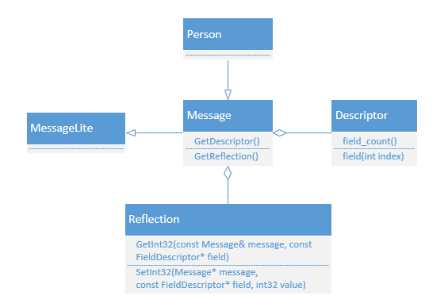

<!--
author: checkking
date: 2017-03-21
title: pprotobuff反射机制的应用-pb转成map
tags: pprotobuff
category: pprotobuff
status: publish
summary: Google Protobuff笔记
-->
### 背景
之前做的一个广告模块，要用用户请求构造特征值去请求机器学习模型模块。我这个模块与下游模块的接口之间的序列化协议是pprotobuff，与上游机器学习模块的序列化协议是公司内部的，而且要求将特征名，特征值都表示成字符串传给机器学习模块做在线预测。因此这当中就有一个转化需求：将pprotobuff转成map。

### 反射相关接口
要介绍pb的反射功能，先看一个相关的UML示例图：



各个类以及接口说明:
#### Message
Person是自定义的pb类型，继承自Message. MessageLite作为Message基类，更加轻量级一些。
通过Message的两个接口`GetDescriptor/GetReflection`，可以获取该类型对应的Descriptor/Reflection。
#### Descriptor
Descriptor是对message类型定义的描述，包括message的名字、所有字段的描述、原始的proto文件内容等。
本文中我们主要关注跟字段描述相关的接口，例如：

1. 获取所有字段的个数：`int field_count() const`
2. 获取单个字段描述类型`FieldDescriptor`的接口有很多个，例如

```cpp
const FieldDescriptor* field(int index) const;//根据定义顺序索引获取
const FieldDescriptor* FindFieldByNumber(int number) const;//根据tag值获取
const FieldDescriptor* FindFieldByName(const string& name) const;//根据field name获取
```
#### FieldDescriptor
FieldDescriptor描述message中的单个字段，例如字段名，字段属性(optional/required/repeated)等。
对于proto定义里的每种类型，都有一种对应的C++类型，例如：
```cpp
enum CppType {
	CPPTYPE_INT32 = 1, //TYPE_INT32, TYPE_SINT32, TYPE_SFIXED32
}
```
获取类型的label属性：
```cpp
enum Label {
	LABEL_OPTIONAL = 1, //optional
	LABEL_REQUIRED = 2, //required
	LABEL_REPEATED = 3, //repeated

	MAX_LABEL = 3, //Constant useful for defining lookup tables indexed by Label.
}
```
获取字段的名称:`const string& name() const;`。
#### Reflection
Reflection主要提供了动态读写pb字段的接口，对pb对象的自动读写主要通过该类完成。
对每种类型，Reflection都提供了一个单独的接口用于读写字段对应的值。
例如对于读操作：
```cpp
virtual int32  GetInt32 (const Message& message,
                           const FieldDescriptor* field) const = 0;
virtual int64  GetInt64 (const Message& message,
                           const FieldDescriptor* field) const = 0;
```

特殊的，对于枚举和嵌套的message：

```cpp
virtual const EnumValueDescriptor* GetEnum(
      const Message& message, const FieldDescriptor* field) const = 0;
// See MutableMessage() for the meaning of the "factory" parameter.
virtual const Message& GetMessage(const Message& message,
                                    const FieldDescriptor* field,
                                    MessageFactory* factory = NULL) const = 0;
```
对于写操作也是类似的接口，例如`SetInt32/SetInt64/SetEnum`等。

### 实现pb转map
```cpp
int pb2map(const google::protobuf::Message& message, 
        std::map<std::string, std::string>* map) {
#define CASE_FIELD_TYPE(cpptype, method, valuetype) \
    case google::protobuf::FieldDescriptor::CPPTYPE_##cpptype:{ \
        valuetype value = reflection->Get##method(message, field); \
        std::ostringstream oss; \
        oss << value; \
        (*map)[field->name()] = oss.str(); \
        break; \
    }

#define CASE_FIELD_TYPE_ENUM() \
    case google::protobuf::FieldDescriptor::CPPTYPE_ENUM: {\
        int value = reflection->GetEnum(message, field)->number(); \
        std::ostringstream oss; \
        oss << value; \
        (*map)[field->name()] = oss.str(); \
        break; \
    }

#define CASE_FIELD_TYPE_STRING() \
    case google::protobuf::FieldDescriptor::CPPTYPE_STRING: { \
        std::string value = reflection->GetString(message, field); \
        (*map)[field->name()] = value; \
        break; \
    }
    const google::protobuf::Descriptor* descriptor = message.GetDescriptor();
    const google::protobuf::Reflection* reflection = message.GetReflection();

    for (int i = 0; i < descriptor->field_count(); ++i) {
        const google::protobuf::FieldDescriptor* field = descriptor->field(i);
        bool has_field = reflection->HasField(message, field);
        if (has_field) {
            if (field->is_repeated()) {
                LOG(WARNING) << "repeated field not supported!";
                return CS_ERR;
            }
            switch (field->cpp_type()) {
                CASE_FIELD_TYPE(INT32, Int32, int);
                CASE_FIELD_TYPE(UINT32, UInt32, uint32_t);
                CASE_FIELD_TYPE(FLOAT, Float, float);
                CASE_FIELD_TYPE(DOUBLE, Double, double);
                CASE_FIELD_TYPE(BOOL, Bool, bool);
                CASE_FIELD_TYPE(INT64, Int64, int64_t);
                CASE_FIELD_TYPE(UINT64, UInt64, uint64_t);
                CASE_FIELD_TYPE_ENUM();
                CASE_FIELD_TYPE_STRING();
                default:
                    LOG(WARNING) << "Unsupported pb message type: [" << field->cpp_type() << "]!";
                    return CS_ERR;
            }
        } else {
            (*map)[field->name()] = std::string("-");
        }
    }

    return CS_OK;

```

### 参考
[protobuf C++ api](https://developers.google.com/protocol-buffers/docs/reference/cpp/#google.protobuf)