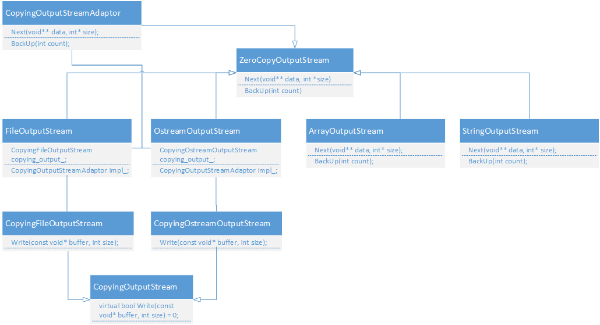

<!--
author: checkking
date: 2017-03-21
title: protobuf之ZeroCopy
tags: protobuf
category: protobuf
status: publish
summary: Google Protobuff笔记
-->
### 引言
我们在序列化、反序列化 Protobuf message 时为了最小化内存拷贝，可以实现其提供的 ZeroCopyStream（包括 ZeroCopyOutputStream 和 ZeroCopyInputStream）接口类，ZeroCopyStream 要求能够进行 buffer 的分配，这体现在一个名为 Next 的接口上，这样做的好处是避免进行内存的拷贝，为了方便理解，我们来看一下 ZeroCopyInputStream 和传统的 stream 的对比.
#### 典型的做法
```cpp
/* 我们调用 input stream 的 Read 从内存中读取数据到 buffer
 * 这里进行了一次拷贝操作，也就是拷贝内存中的数据到 buffer 中
 * 之后 DoSomething 才能处理此数据
 */
char buffer[BUFFER_SIZE];
input->Read(buffer, BUFFER_SIZE);
DoSomething(buffer, BUFFER_SIZE);
```
#### ZeroCopyStream
```cpp
/*
* 使用 Next 接口的做法，input stream 内部有责任提供（分配）buffer
* 也就是说，DoSomething 可以直接操作内部的内存，而无需拷贝后再操作
* 这就避免了一次内存拷贝
*/
const void* buffer;
int size;
input->Next(&buffer, &size);
DoSomething(buffer, size);
```
### protbuff 相关接口
protobuf作为一个消息格式的利器，在io的接口设计上也非常巧妙，本文主要想介绍下其中ZeroCopy的思想以及用途。

message序列化和反序列化时，我们常用的有以下几种接口
```cpp
// Parse a protocol buffer contained in a string.
bool ParseFromString(const string& data);
// Parse a protocol buffer contained in an array of bytes.
bool ParseFromArray(const void* data, int size);
// Parse a protocol buffer from a file descriptor.  If successful, the entire
// input will be consumed.
bool ParseFromFileDescriptor(int file_descriptor);
```
实际上，对于io操作，pb还提供了`ZeroCopyStream`的接口用于数据读写以及序列化/反序列化的操作。
```cpp
// Read a protocol buffer from the given zero-copy input stream.  If
// successful, the entire input will be consumed.
bool ParseFromZeroCopyStream(io::ZeroCopyInputStream* input);

// Write the message to the given zero-copy output stream.  All required
// fields must be set.
bool SerializeToZeroCopyStream(io::ZeroCopyOutputStream* output) const;
```
#### ZeroCopyStream的设计
ZeroCopyStream在接口设计上目标是最小化数据buffer的拷贝次数，省略掉stream内部数据memcpy到用户buffer的过程。因此，ZeroCopyStream在设计上，buffer内存的管理权被stream本身接管，而不是传统上我们熟悉的调用者申请buffer内存，交给stream填充的方式。

ZeroCopyStream按照输入输出在protobuf里实现为两个类:`ZeroCopyInputStream` 和 `ZeroCopyOutputStream`。

这两个类都是虚基类，用户对应的ZeroCopyStream子类实现自己的IO操作，这样就可以作为参数对接message前面提到的序列化/反序列化接口了。在我看来，这是protobuf极大的提高了扩展性的一个设计，也是`ZeroCopyStream`最重要的作用。
#### ZeroCopyStream的接口
`ZeroCopyStream`在protobuf内部使用相当广泛，相关代码都组织在google/protobuf/io目录下。按照功能分为input/output，protobuf实现了一些zerocopy的类，比如文件流，从两个虚基类`ZeroCopyOutputStream/ZeroCopyInputStream`继承而来，在实现我们自定义的stream类时，可以参考现成的实现。

接下来我们分别介绍下`ZeroCopyOutputStream/ZeroCopyInputStream`的接口设计以及使用。

#####  ZeroCopyOutputStream
主要有三个接口：
```cpp
//返回一段可写的连续内存及大小,内存申请/释放由stream本身管理
//内存buffer大小为*size，*data指向了这段内存
//调用方写入后*data指向的这段内存最终会写到输出端（写入时间不确定）
virtual bool Next(void** data, int* size) = 0;

//归还Next申请的部分内存：由Next申请的内存大小为size
//调用方要写入的数据小于size时，为了避免写入buffer末尾的无效数据，通过该接口指定末尾多少数据是无效的
//个人觉得BackUp这个命名很难直接理解，叫Return更合适一些
virtual void BackUp(int count) = 0;

//写入的字节总数
virtual int64 ByteCount() const = 0;
```
`FileOutputStream`是`ZeroCopyOutputStream`的子类，实现了文件的zerocopy写入数据流。我们用`FileOutputStream`举一个例子：
```cpp
int outfd = open(filename.c_str(), O_CREAT | O_WRONLY | O_TRUNC, 0644);
ZeroCopyOutputStream* out_stream = new FileOutputStream(outfd, 1024);

//构造要写入文件的内容
std::vector<std::string> contents;
contents.push_back("hello");
contents.push_back("world");
contents.push_back("c++");
void* buffer = NULL;
int size = 0;

//逐个写入contents
for (size_t i = 0; i < contents.size(); ++i) {
    //从stream申请buffer用于写入
    if (!out_stream->Next(&buffer, &size)) {
        printf("Next failed.\n");
        break;
    }

    printf("buffer:%x, size:%d\n", buffer, size);
    const std::string& content = contents[i];
    // 1 for character \n appended
    if (size > content.size() + 1) {
        //要写入的内容以及\n cp到buffer
        memcpy(buffer, content.c_str(), content.size());
        memcpy(buffer + content.size(), "\n", 1);

        //写入大小为content.size() + 1，使用BackUp返回
        out_stream->BackUp(size - content.size() - 1);
    }
}

delete out_stream;
close(outfd);
```
代码里注释了接口的基本用法，运行后可以正常写入`$filename`的文件。

这个例子的问题是：通过例子无法理解`ZeroCopyOutputStream`的接口为什么要这么设计？因为直接调用fwrite连我们的memcpy都省了。这里说下我的看法，在网络编程中，网络库本身是一定需要缓冲区的，`socket.write`可能失败，可能需要重试。对应用层来讲，比如我们定义了某种消息结构，需要先序列化到应用层的某块内存，然后传递给网络库，网络库memcpy到内部的缓冲区。而这种暴露buffer出来的做法，省略了memcpy的过程，应用层可以直接操作网络库内部的缓冲区，同时也省略掉了我们`char
buffer[1024]; char tmp_buffer[4096];`这种代码。
##### ZeroCopyInputStream
主要有四个接口，其中三个接口与`ZeroCopyOutputStream`命名相同。
```cpp
//返回读取的内容，*data指向这段内容，内容长度存储在size
virtual bool Next(const void** data, int* size) = 0;

//归还Next读取的部分内容，长度为count。注意count需要小于Next返回的size。
//主要用于某些输入流Next返回的内容过长时，使用该接口可以将流指针的位置往前移动。
//比如在读取 sequence file时会比较有用。
virtual void BackUp(int count) = 0;

//跳过一些字节
virtual bool Skip(int count) = 0;

//当前读取的字节总数，注意是应用级别的，比如使用BackUp归还的内容长度不计算在ByteCount内。
virtual int64 ByteCount() const = 0;
```
`FileInputStream`是`ZeroCopyInputStream`的子类，实现了文件的输入流。我们用`FileInputStream`看下各个接口的用法

```cpp
int infd = open(filename.c_str(), O_RDONLY);
//第二个参数为每次读取的最大字节数，这里设置为10方便观察效果
ZeroCopyInputStream* in_stream = new FileInputStream(infd, 10);

const void* buffer;
int size = 0;
int i = 0;
const int skiped_len = 2;
const int backup_len = 5;
//读取的内容存储在buffer，大小为size
while (in_stream->Next(&buffer, &size)) {
    //Skip指定跳过的字节数，当到达文件末尾时返回false
    bool skiped = in_stream->Skip(skiped_len);
    //BackUp指定回退的字节数，需要小于size
    if (backup_len < size) {
        in_stream->BackUp(backup_len);
    }
    printf("\n%d Next size:%d bytecount:%d\n", i++, size, in_stream->ByteCount());
    //输出读到的内容
    std::cout.write((const char*)buffer, size);
}
```
从`FileInputStream`可以体会到相同的思想，就是buffer由stream控制。

#### ZeroCopyStream的子类
关于如何从ZeroCopyStream继承子类，protobuf内部已经实现了丰富的示例，画了一张输出流的UML图


其中`File/Ostream/Array/String`分别接受对应的输入流参数，例如文件描述符，stream，内部buffer和string。

例如我们常用的序列化接口
```cpp
bool Message::SerializeToFileDescriptor(int file_descriptor)
```
实际实现是用到了`FileOutputStream`
```cpp
bool Message::SerializeToFileDescriptor(int file_descriptor) const {
    io::FileOutputStream output(file_descriptor);
    return SerializeToZeroCopyStream(&output);
}
```

### 参考
1. [Protobuff API](https://developers.google.com/protocol-buffers/docs/reference/cpp/google.protobuf.io.zero_copy_stream)
