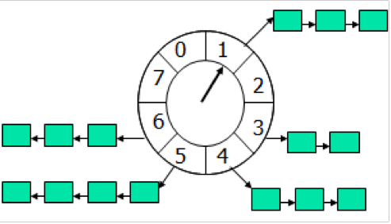

<!--
author: checkking
date: 2017-04-08
title: 用timing wheel踢掉空闲连接
tags: tcp,rpc
category: tcp
status: publish
summary: rpc框架中如何处理空闲连接的
-->
如果一个连接连续几秒内没有收到数据，就把它断开，为此有两种简单、粗暴的做法：

- 每个连接保存"最后收到数据的时间`lastReceiveTime`"， 然后用一个定时器，每秒
遍历一遍所有的连接，断开那些(now - connection.lastReceiveTime) > 8s的connection。
这种做法全局只有一个repeated timer, 不过每次timeout都要检查全部连接，如果连接数目
比较大(几千万), 这一步可能比较费时。
- 每个连接设置一个one-shot timer, 超时定为8s, 在超时的时候就断开本连接。当然，
每次收到数据要去更新timer。这种做法需要很多one-shot timer, 会频繁地更新timers。如果连接数目比较大，可能对EventLoop的
TimerQueue造成压力。

使用timing wheel能够避免上述两种做法的缺点。timing wheel可以翻译为"时间轮盘"或"刻度盘"。

#### timing wheel原理
定时轮是一种数据结构，其主体是一个循环列表（circular buffer），每个列表中包含一个称之为槽（slot）的结构（附图）。
至于 slot 的具体结构依赖具体应用场景。
以本文开头所述的管理大量连接 timeout 的场景为例，描述一下 timing wheel的具体实现细节。



定时轮的工作原理可以类比于始终，如上图箭头（指针）按某一个方向按固定频率轮动，每一次跳动称为一个 tick。
这样可以看出定时轮由个3个重要的属性参数，ticksPerWheel（一轮的tick数），tickDuration（一个tick的持续时间）
以及 timeUnit（时间单位），例如 当ticksPerWheel=60，tickDuration=1，timeUnit=秒，这就和现实中的始终的秒针走动完全类似了。

这里给出一种简单的实现方式，指针按 tickDuration 的设置进行固定频率的转动，其中的必要约定如下：

1. 新加入的对象总是保存在当前指针转动方向上一个位置
2. 相等的对象仅存在于一个 slot 中
3. 指针转动到当前位置对应的 slot 中保存的对象就意味着 timeout 了

在 Timing Wheel 模型中包含4种操作：

Client invoke：

1. START_TIMER(Interval, Request_ID, Expiry_Action)
2. STOP_TIMER(Request_ID)

Timer tick invoke：

3. PER_TICK_BOOKKEEPING
4. EXPIRY_PROCESSING

Timing Wheel 实现中主要考察的是前3种操作的时间和空间复杂度，而第4种属于超时处理通常实现为回调方法，由调用方的实现决定其效率，下面看一个用 Java 实现的 Timing Wheel 的具体例子：
```java
TimingWheel.java

/**
 * A timing-wheel optimized for approximated I/O timeout scheduling.<br>
 * {@link TimingWheel} creates a new thread whenever it is instantiated and started, so don't create many instances.
 * <p>
 * <b>The classic usage as follows:</b><br>
 * <li>using timing-wheel manage any object timeout</li>
 * <pre>
 *    // Create a timing-wheel with 60 ticks, and every tick is 1 second.
 *    private static final TimingWheel<CometChannel> TIMING_WHEEL = new TimingWheel<CometChannel>(1, 60, TimeUnit.SECONDS);
 *    
 *    // Add expiration listener and start the timing-wheel.
 *    static {
 *    	TIMING_WHEEL.addExpirationListener(new YourExpirationListener());
 *    	TIMING_WHEEL.start();
 *    }
 *    
 *    // Add one element to be timeout approximated after 60 seconds
 *    TIMING_WHEEL.add(e);
 *    
 *    // Anytime you can cancel count down timer for element e like this
 *    TIMING_WHEEL.remove(e);
 * </pre>
 * 
 * After expiration occurs, the {@link ExpirationListener} interface will be invoked and the expired object will be 
 * the argument for callback method {@link ExpirationListener#expired(Object)}
 * <p>
 * {@link TimingWheel} is based on <a href="http://cseweb.ucsd.edu/users/varghese/">George Varghese</a> and Tony Lauck's paper,
 * <a href="http://cseweb.ucsd.edu/users/varghese/PAPERS/twheel.ps.Z">'Hashed and Hierarchical Timing Wheels: data structures 
 * to efficiently implement a timer facility'</a>.  More comprehensive slides are located <a href="http://www.cse.wustl.edu/~cdgill/courses/cs6874/TimingWheels.ppt">here</a>.
 * 
 * @author mindwind
 * @version 1.0, Sep 20, 2012
 */
public class TimingWheel<E> {
	
	private final long tickDuration;
	private final int ticksPerWheel;
	private volatile int currentTickIndex = 0;
	
	private final CopyOnWriteArrayList<ExpirationListener<E>> expirationListeners = new CopyOnWriteArrayList<ExpirationListener<E>>();
	private final ArrayList<Slot<E>> wheel;
	private final Map<E, Slot<E>> indicator = new ConcurrentHashMap<E, Slot<E>>();
	
	private final AtomicBoolean shutdown = new AtomicBoolean(false);
	private final ReadWriteLock lock = new ReentrantReadWriteLock();
	private Thread workerThread;
	
	// ~ -------------------------------------------------------------------------------------------------------------

	/**
	 * Construct a timing wheel.
	 * 
	 * @param tickDuration
	 *            tick duration with specified time unit.
	 * @param ticksPerWheel
	 * @param timeUnit
	 */
	public TimingWheel(int tickDuration, int ticksPerWheel, TimeUnit timeUnit) {
		if (timeUnit == null) {
            throw new NullPointerException("unit");
        }
		if (tickDuration <= 0) {
            throw new IllegalArgumentException("tickDuration must be greater than 0: " + tickDuration);
        }
        if (ticksPerWheel <= 0) {
            throw new IllegalArgumentException("ticksPerWheel must be greater than 0: " + ticksPerWheel);
        }
		
        this.wheel = new ArrayList<Slot<E>>();
		this.tickDuration = TimeUnit.MILLISECONDS.convert(tickDuration, timeUnit);
		this.ticksPerWheel = ticksPerWheel + 1;
		
		for (int i = 0; i < this.ticksPerWheel; i++) {
			wheel.add(new Slot<E>(i));
		}
		wheel.trimToSize();
		
		workerThread = new Thread(new TickWorker(), "Timing-Wheel");
	}
	
	// ~ -------------------------------------------------------------------------------------------------------------
	
	public void start() {
		if (shutdown.get()) {
            throw new IllegalStateException("Cannot be started once stopped");
        }

        if (!workerThread.isAlive()) {
            workerThread.start();
        }
	}
	
	public boolean stop() {
		if (!shutdown.compareAndSet(false, true)) {
			return false;
		}
		
		boolean interrupted = false;
		while (workerThread.isAlive()) {
			workerThread.interrupt();
			try {
				workerThread.join(100);
			} catch (InterruptedException e) {
				interrupted = true;
			}
		}
		if (interrupted) {
            Thread.currentThread().interrupt();
        }
		
		return true;
	}
	
	public void addExpirationListener(ExpirationListener<E> listener) {
        expirationListeners.add(listener);
    }
	
	public void removeExpirationListener(ExpirationListener<E> listener) {
        expirationListeners.remove(listener);
    }
	
	/**
	 * Add a element to {@link TimingWheel} and start to count down its life-time.
	 * 
	 * @param e
	 * @return remain time to be expired in millisecond.
	 */
	public long add(E e) {
		synchronized(e) {
			checkAdd(e);
			
			int previousTickIndex = getPreviousTickIndex();
			Slot<E> slot = wheel.get(previousTickIndex);
			slot.add(e);
			indicator.put(e, slot);
			
			return (ticksPerWheel - 1) * tickDuration;
		}
	}
	
	private void checkAdd(E e) {
		Slot<E> slot = indicator.get(e);
		if (slot != null) {
			slot.remove(e);
		}
	}
	
	private int getPreviousTickIndex() {
		lock.readLock().lock();
		try {
			int cti = currentTickIndex;
			if (cti == 0) {
				return ticksPerWheel - 1;
			}
			
			return cti - 1;
		} finally {
			lock.readLock().unlock();
		}
	}
	
	/**
	 * Removes the specified element from timing wheel.
	 * 
	 * @param e
	 * @return <tt>true</tt> if this timing wheel contained the specified
	 *         element
	 */
	public boolean remove(E e) {
		synchronized (e) {
			Slot<E> slot = indicator.get(e);
			if (slot == null) {
				return false;
			}

			indicator.remove(e);
			return slot.remove(e) != null;
		}
	}

	private void notifyExpired(int idx) {
		Slot<E> slot = wheel.get(idx);
		Set<E> elements = slot.elements();
		for (E e : elements) {
			slot.remove(e);
			synchronized (e) {
				Slot<E> latestSlot = indicator.get(e);
				if (latestSlot.equals(slot)) {
					indicator.remove(e);
				}
			}
			for (ExpirationListener<E> listener : expirationListeners) {
				listener.expired(e);
			}
		}
	}
	
	// ~ -------------------------------------------------------------------------------------------------------------
	 
	private class TickWorker implements Runnable {

		private long startTime;
		private long tick;

		@Override
		public void run() {
			startTime = System.currentTimeMillis();
			tick = 1;

			for (int i = 0; !shutdown.get(); i++) {
				if (i == wheel.size()) {
					i = 0;
				}
				lock.writeLock().lock();
				try {
					currentTickIndex = i;
				} finally {
					lock.writeLock().unlock();
				}
				notifyExpired(currentTickIndex);
				waitForNextTick();
			}
		}

		private void waitForNextTick() {
			for (;;) {
                long currentTime = System.currentTimeMillis();
                long sleepTime = tickDuration * tick - (currentTime - startTime);

                if (sleepTime <= 0) {
                    break;
                }

                try {
                    Thread.sleep(sleepTime);
                } catch (InterruptedException e) {
                    return;
                }
            }
			
			tick++;
		}
	}
	
	private static class Slot<E> {
		
		private int id;
		private Map<E, E> elements = new ConcurrentHashMap<E, E>();
		
		public Slot(int id) {
			this.id = id;
		}

		public void add(E e) {
			elements.put(e, e);
		}
		
		public E remove(E e) {
			return elements.remove(e);
		}
		
		public Set<E> elements() {
			return elements.keySet();
		}

		@Override
		public int hashCode() {
			final int prime = 31;
			int result = 1;
			result = prime * result + id;
			return result;
		}

		@Override
		public boolean equals(Object obj) {
			if (this == obj)
				return true;
			if (obj == null)
				return false;
			if (getClass() != obj.getClass())
				return false;
			@SuppressWarnings("rawtypes")
			Slot other = (Slot) obj;
			if (id != other.id)
				return false;
			return true;
		}

		@Override
		public String toString() {
			return "Slot [id=" + id + ", elements=" + elements + "]";
		}
		
	}
	
}
```

```java
/**
 * A listener for expired object events.
 * 
 * @author mindwind
 * @version 1.0, Sep 20, 2012
 * @see TimingWheel
 */
public interface ExpirationListener<E> {
	
	/**
	 * Invoking when a expired event occurs.
	 * 
	 * @param expiredObject
	 */
	void expired(E expiredObject);
	
}
```

我们分析一下这个简化版本  TimingWheel 实现中的 4 个主要操作的实现：


START_TIMER(Interval, Request_ID, Expiry_Action) ，这段伪代码的实现对应于TimingWheel的 add(E e) 方法。

- 首先检查同样的元素是否已添加到 TimingWheel 中，若已存在则删除旧的引用，重新安置元素在wheel中位置。这个检查是为了满足约束条件2（相等的对象仅存在于一个 slot 中，重新加入相同的元素相当于重置了该元素的 Timer）
- 获取当前 tick 指针位置的前一个 slot 槽位，放置新加入的元素，并在内部记录下该位置
- 返回新加入元素的 timeout 时间，以毫秒计算（一般的应用级程序到毫秒这个精度已经足够了）
- 显然，时间复杂度为O(1)


STOP_TIMER(Request_ID)，这段伪代码的实现对应于TimingWheel的 remove(E e) 方法。
- 获取元素在 TimingWheel 中对应 slot 位置
- 从中 slot 中删除
- 显然，时间复杂度也为O(1)


 PER_TICK_BOOKKEEPING，伪代码对应于 TimingWheel 中 TickerWorker 中的  run() 方法。
- 获取当前 tick 指针的 slot
- 对当前 slot 的所有元素进行 timeout 处理（notifyExpired()）
- ticker 不需要针对每个元素去判断其 timeout 时间，故时间复杂度也为 O(1)
 EXPIRY_PROCESSING，伪代码对应于TimingWheel 中的 notifyExpired() 方法
- 实现了对每个 timeout 元素的 Expiry_Action 处理
- 这里时间复杂度显然 是 O(n)的。
在维护大量连接的例子中：
- 连接建立时，把一个连接放入 TimingWheel 中进入 timeout 倒计时
- 每次收到长连接心跳时，重新加入一次TimingWheel 相当于重置了 timer
timeout 时间到达时触发 EXPIRY_PROCESSING
- EXPIRY_PROCESSING 实际就是关闭超时的连接。

这个简化版的 TimingWheel 实现一个实例只能支持一个固定的 timeout 时长调度，不能支持对于每个元素特定的 timeout 时长。
一种改进的做法是设计一个函数，计算每个元素特定的deadline，并根据deadline计算放置在wheel中的特定位置，这个以后再完善。
