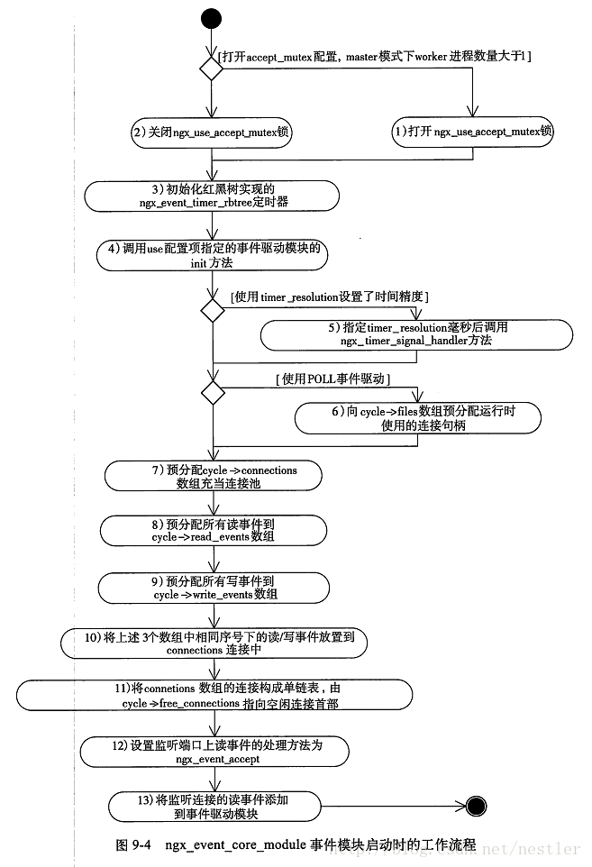
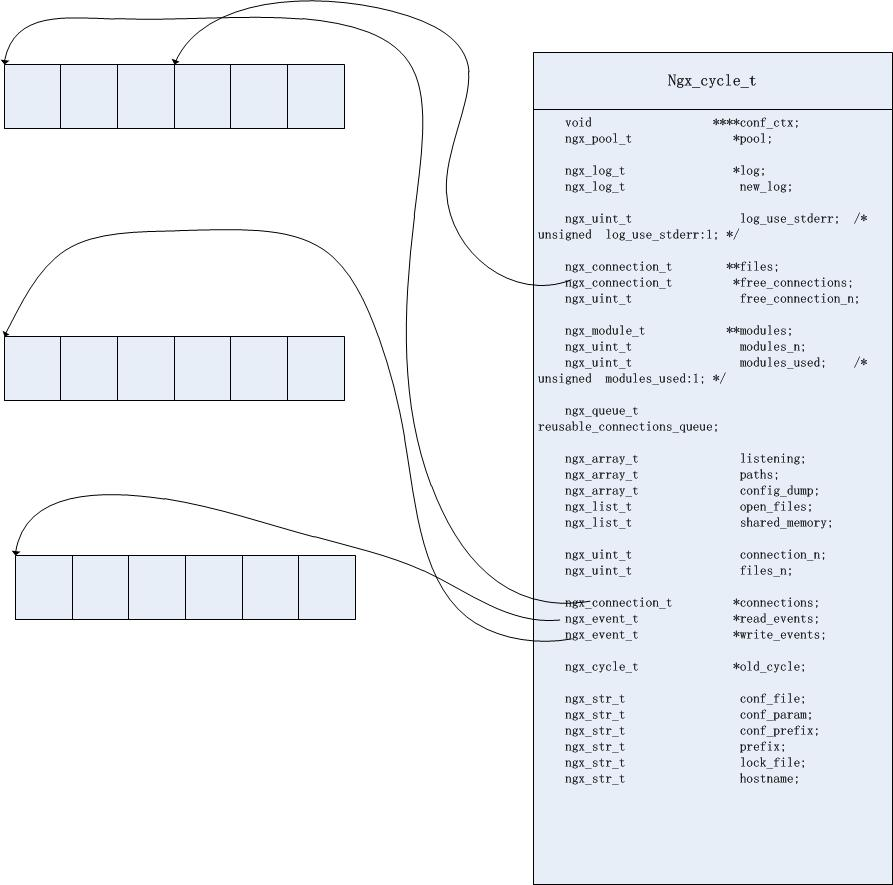

<!--
author: checkking
date: 2017-04-15
title: nginx事件模块
tags: nginx
category: nginx
status: publish
summary: nginx事件模块分析
-->
#### 整体流程分析
先列出`event`模块相关定义的:
```c

static ngx_command_t  ngx_events_commands[] = {

    { ngx_string("events"),
      NGX_MAIN_CONF|NGX_CONF_BLOCK|NGX_CONF_NOARGS,
      ngx_events_block,
      0,
      0,
      NULL },

      ngx_null_command
};


static ngx_core_module_t  ngx_events_module_ctx = {
    ngx_string("events"),
    NULL,
    ngx_event_init_conf
};

ngx_module_t  ngx_events_module = {
    NGX_MODULE_V1,
    &ngx_events_module_ctx,                /* module context */
    ngx_events_commands,                   /* module directives */
    NGX_CORE_MODULE,                       /* module type */
    NULL,                                  /* init master */
    NULL,                                  /* init module */
    NULL,                                  /* init process */
    NULL,                                  /* init thread */
    NULL,                                  /* exit thread */
    NULL,                                  /* exit process */
    NULL,                                  /* exit master */
    NGX_MODULE_V1_PADDING
};
```

在`ngx_init_cycle`函数中，有下面部分代码:
```c
    for (i = 0; cycle->modules[i]; i++) {
        if (cycle->modules[i]->type != NGX_CORE_MODULE) {
            continue;
        }

        module = cycle->modules[i]->ctx;

        if (module->create_conf) {
            rv = module->create_conf(cycle);
            if (rv == NULL) {
                ngx_destroy_pool(pool);
                return NULL;
            }
            cycle->conf_ctx[cycle->modules[i]->index] = rv;
        }
    }
```
这部分代码对所有`module`的配置创建，但是`event`模块没有定义`create_conf`方法，所以这一步省略。
```c
    for (i = 0; cycle->modules[i]; i++) {
        if (cycle->modules[i]->type != NGX_CORE_MODULE) {
            continue;
        }

        module = cycle->modules[i]->ctx;

        if (module->init_conf) {
            if (module->init_conf(cycle,
                                  cycle->conf_ctx[cycle->modules[i]->index])
                == NGX_CONF_ERROR)
            {
                environ = senv;
                ngx_destroy_cycle_pools(&conf);
                return NULL;
            }
        }
    }
```
这部分代码中，对所有模块配置进行初始化，我们来看下`ngx_event_init_conf`方法：
```c
static char *
ngx_event_init_conf(ngx_cycle_t *cycle, void *conf)
{
    if (ngx_get_conf(cycle->conf_ctx, ngx_events_module) == NULL) {
        ngx_log_error(NGX_LOG_EMERG, cycle->log, 0,
                      "no \"events\" section in configuration");
        return NGX_CONF_ERROR;
    }

    return NGX_CONF_OK;
}
```
可以看到，`ngx_events_module_ctx`实现的接口只是定义了模块名，`ngx_core_module_t`接口中定义的`create_conf`,`init_conf`方法都没有实现。这是因为`ngx_events_module`模块并不会解析配置项的参数，只是在出现`events`配置项后会调用各事件模块去解析`evnets{...}`块内的配置项。

在`ngx_init_cycle`函数中调用了`ngx_init_modules`函数:
```c
ngx_int_t
ngx_init_modules(ngx_cycle_t *cycle)
{
    ngx_uint_t  i;

    for (i = 0; cycle->modules[i]; i++) {
        if (cycle->modules[i]->init_module) {
            if (cycle->modules[i]->init_module(cycle) != NGX_OK) {
                return NGX_ERROR;
            }
        }
    }

    return NGX_OK;
}
```
但是`ngx_events_module`并没有实现`init_module`, 所以这一步也跳过。

接下来打开监听`sockets`(调用`ngx_open_listening_sockets`方法)：
```c
    for (tries = 5; tries; tries--) {
        failed = 0;

        /* for each listening socket */

        ls = cycle->listening.elts;
        for (i = 0; i < cycle->listening.nelts; i++) {

            if (ls[i].ignore) {
                continue;
            }

#if (NGX_HAVE_REUSEPORT)

            if (ls[i].add_reuseport) {

                /*
                 * to allow transition from a socket without SO_REUSEPORT
                 * to multiple sockets with SO_REUSEPORT, we have to set
                 * SO_REUSEPORT on the old socket before opening new ones
                 */

                int  reuseport = 1;

                if (setsockopt(ls[i].fd, SOL_SOCKET, SO_REUSEPORT,
                               (const void *) &reuseport, sizeof(int))
                    == -1)
                {
                    ngx_log_error(NGX_LOG_ALERT, cycle->log, ngx_socket_errno,
                                  "setsockopt(SO_REUSEPORT) %V failed, ignored",
                                  &ls[i].addr_text);
                }

                ls[i].add_reuseport = 0;
            }
#endif

            if (ls[i].fd != (ngx_socket_t) -1) {
                continue;
            }

            if (ls[i].inherited) {

                /* TODO: close on exit */
                /* TODO: nonblocking */
                /* TODO: deferred accept */

                continue;
            }

            s = ngx_socket(ls[i].sockaddr->sa_family, ls[i].type, 0);

            if (s == (ngx_socket_t) -1) {
                ngx_log_error(NGX_LOG_EMERG, log, ngx_socket_errno,
                              ngx_socket_n " %V failed", &ls[i].addr_text);
                return NGX_ERROR;
            }

            if (setsockopt(s, SOL_SOCKET, SO_REUSEADDR,
                           (const void *) &reuseaddr, sizeof(int))
                == -1)
            {
                ngx_log_error(NGX_LOG_EMERG, log, ngx_socket_errno,
                              "setsockopt(SO_REUSEADDR) %V failed",
                              &ls[i].addr_text);

                if (ngx_close_socket(s) == -1) {
                    ngx_log_error(NGX_LOG_EMERG, log, ngx_socket_errno,
                                  ngx_close_socket_n " %V failed",
                                  &ls[i].addr_text);
                }

                return NGX_ERROR;
            }

#if (NGX_HAVE_REUSEPORT)

            if (ls[i].reuseport) {
                int  reuseport;

                reuseport = 1;

                if (setsockopt(s, SOL_SOCKET, SO_REUSEPORT,
                               (const void *) &reuseport, sizeof(int))
                    == -1)
                {
                    ngx_log_error(NGX_LOG_EMERG, log, ngx_socket_errno,
                                  "setsockopt(SO_REUSEPORT) %V failed, ignored",
                                  &ls[i].addr_text);

                    if (ngx_close_socket(s) == -1) {
                        ngx_log_error(NGX_LOG_EMERG, log, ngx_socket_errno,
                                      ngx_close_socket_n " %V failed",
                                      &ls[i].addr_text);
                    }

                    return NGX_ERROR;
                }
            }
#endif

#if (NGX_HAVE_INET6 && defined IPV6_V6ONLY)

            if (ls[i].sockaddr->sa_family == AF_INET6) {
                int  ipv6only;

                ipv6only = ls[i].ipv6only;

                if (setsockopt(s, IPPROTO_IPV6, IPV6_V6ONLY,
                               (const void *) &ipv6only, sizeof(int))
                    == -1)
                {
                    ngx_log_error(NGX_LOG_EMERG, log, ngx_socket_errno,
                                  "setsockopt(IPV6_V6ONLY) %V failed, ignored",
                                  &ls[i].addr_text);
                }
            }
#endif
            /* TODO: close on exit */

            if (!(ngx_event_flags & NGX_USE_IOCP_EVENT)) {
                if (ngx_nonblocking(s) == -1) {
                    ngx_log_error(NGX_LOG_EMERG, log, ngx_socket_errno,
                                  ngx_nonblocking_n " %V failed",
                                  &ls[i].addr_text);

                    if (ngx_close_socket(s) == -1) {
                        ngx_log_error(NGX_LOG_EMERG, log, ngx_socket_errno,
                                      ngx_close_socket_n " %V failed",
                                      &ls[i].addr_text);
                    }

                    return NGX_ERROR;
                }
            }

            ngx_log_debug2(NGX_LOG_DEBUG_CORE, log, 0,
                           "bind() %V #%d ", &ls[i].addr_text, s);

            if (bind(s, ls[i].sockaddr, ls[i].socklen) == -1) {
                err = ngx_socket_errno;

                if (err != NGX_EADDRINUSE || !ngx_test_config) {
                    ngx_log_error(NGX_LOG_EMERG, log, err,
                                  "bind() to %V failed", &ls[i].addr_text);
                }

                if (ngx_close_socket(s) == -1) {
                    ngx_log_error(NGX_LOG_EMERG, log, ngx_socket_errno,
                                  ngx_close_socket_n " %V failed",
                                  &ls[i].addr_text);
                }

                if (err != NGX_EADDRINUSE) {
                    return NGX_ERROR;
                }

                if (!ngx_test_config) {
                    failed = 1;
                }

                continue;
            }

#if (NGX_HAVE_UNIX_DOMAIN)

            if (ls[i].sockaddr->sa_family == AF_UNIX) {
                mode_t   mode;
                u_char  *name;

                name = ls[i].addr_text.data + sizeof("unix:") - 1;
                mode = (S_IRUSR|S_IWUSR|S_IRGRP|S_IWGRP|S_IROTH|S_IWOTH);

                if (chmod((char *) name, mode) == -1) {
                    ngx_log_error(NGX_LOG_EMERG, cycle->log, ngx_errno,
                                  "chmod() \"%s\" failed", name);
                }

                if (ngx_test_config) {
                    if (ngx_delete_file(name) == NGX_FILE_ERROR) {
                        ngx_log_error(NGX_LOG_EMERG, cycle->log, ngx_errno,
                                      ngx_delete_file_n " %s failed", name);
                    }
                }
            }
#endif

            if (ls[i].type != SOCK_STREAM) {
                ls[i].fd = s;
                continue;
            }

            if (listen(s, ls[i].backlog) == -1) {
                err = ngx_socket_errno;

                /*
                 * on OpenVZ after suspend/resume EADDRINUSE
                 * may be returned by listen() instead of bind(), see
                 * https://bugzilla.openvz.org/show_bug.cgi?id=2470
                 */

                if (err != NGX_EADDRINUSE || !ngx_test_config) {
                    ngx_log_error(NGX_LOG_EMERG, log, err,
                                  "listen() to %V, backlog %d failed",
                                  &ls[i].addr_text, ls[i].backlog);
                }

                if (ngx_close_socket(s) == -1) {
                    ngx_log_error(NGX_LOG_EMERG, log, ngx_socket_errno,
                                  ngx_close_socket_n " %V failed",
                                  &ls[i].addr_text);
                }

                if (err != NGX_EADDRINUSE) {
                    return NGX_ERROR;
                }

                if (!ngx_test_config) {
                    failed = 1;
                }

                continue;
            }

            ls[i].listen = 1;

            ls[i].fd = s;
        }

        if (!failed) {
            break;
        }

        /* TODO: delay configurable */

        ngx_log_error(NGX_LOG_NOTICE, log, 0,
                      "try again to bind() after 500ms");

        ngx_msleep(500);
    }
```
可以看到, `ngx_open_listening_sockets`主要功能是`socket`、`bind`和`listen`函数的调用，最终创建完的监听套接字就在cycle结构体的listening域里, 并且设置`socket`为可重用的，而且是非阻塞的。

然后是调用`ngx_configure_listening_sockets`方法，对监听`socket`进行配置, 是调用unix网络接口函数`setsockopt`进行配置的, 使用了下面这些参数：

|socket选项|选项描述|nginx相关代码|nginx中使用目的|nginx.conf相关|
|--------|--------|-------------|----------|--------------|
|SO_RECVBUF|设置TCP套接字接收缓冲区大小|`setsockopt(ls[i].fd, SOL_SOCKET, SO_RCVBUF,(const void *) &ls[i].rcvbuf, sizeof(int)`|根据配置设置tcp套接字缓冲区|`listen address[:port][rcvbuf=size]`|
|SO_SNDBUF|设置TCP套接字发送缓冲区大小| `setsockopt(ls[i].fd, SOL_SOCKET, SO_SNDBUF,(const void *) &ls[i].sndbuf, sizeof(int)`|根据配置设置tcp发送缓冲区大小|`listen address[:port][sndbuf=size]`|
|SO_KEEPALIVE|SO_KEEPALIVE 保持连接检测对方主机是否崩溃，避免（服务器）永远阻塞于TCP连接的输入|`setsockopt(ls[i].fd, SOL_SOCKET, SO_KEEPALIVE,(const void *) &value, sizeof(int)`|与客户端保持长连接|`listen address[:port] [so_keepalive=on`|
|TCP_KEEPIDLE|对一个连接进行有效性探测之前运行的最大非活跃时间间隔，默认值为 14400（即 2 个小时） |`setsockopt(ls[i].fd, IPPROTO_TCP, TCP_KEEPIDLE,(const void *) &value, sizeof(int)`|与keepalive结合，与客户端保持长连接|`listen address[:port] [so_keepalive=on keepidle`|

这里只列举了几个，其他的可以参考nginx源码。

接着就是初始化各个`modules`:
```c
    if (ngx_init_modules(cycle) != NGX_OK) {
        /* fatal */
        exit(1);
    }
```
```c
ngx_int_t
ngx_init_modules(ngx_cycle_t *cycle)
{
    ngx_uint_t  i;

    for (i = 0; cycle->modules[i]; i++) {
        if (cycle->modules[i]->init_module) {
            if (cycle->modules[i]->init_module(cycle) != NGX_OK) {
                return NGX_ERROR;
            }
        }
    }

    return NGX_OK;
}
```
其中`ngx_event_core_module_ctx`和`ngx_evnet_core_module`的定义如下：

```c
ngx_event_module_t  ngx_event_core_module_ctx = {
    &event_core_name,
    ngx_event_core_create_conf,            /* create configuration */
    ngx_event_core_init_conf,              /* init configuration */

    { NULL, NULL, NULL, NULL, NULL, NULL, NULL, NULL, NULL, NULL }
};
```
```c
ngx_module_t  ngx_event_core_module = {
    NGX_MODULE_V1,
    &ngx_event_core_module_ctx,            /* module context */
    ngx_event_core_commands,               /* module directives */
    NGX_EVENT_MODULE,                      /* module type */
    NULL,                                  /* init master */
    ngx_event_module_init,                 /* init module */
    ngx_event_process_init,                /* init process */
    NULL,                                  /* init thread */
    NULL,                                  /* exit thread */
    NULL,                                  /* exit process */
    NULL,                                  /* exit master */
    NGX_MODULE_V1_PADDING
};
```
它实现了`ngx_evnet_module_init`方法和`ngx_event_process_init`方法。在nginx启动过程中还没有fork出worker子进程时，会首先调用`ngx_event_core_module`模块的`ngx_evnet_module_init`方法，而在`fork`出`worker`进程后，每一个`worker`进程会在调用`ngx_event_core_module`模块的`ngx_event_process_init`方法后才会进入正式的工作循环。

`ngx_event_module_init`方法其实很简单，它主要初始化了一些变量，尤其是`ngx_http_stub_status_module`统计模块使用的一些原子性的统计变量。

而`ngx_event_proces_init`方法就做了许多事情，总流程图如下：



这里有几个点需要特别讲解一下。

#### nginx连接池
nginx在接收客户端的连接时，所使用的`ngx_connection_t`结构体都是在启动阶段就预分配好的，使用时从连接池获取即可。连接池示意图如下所示：



`ngx_cycle_t`中的`connections`和`free_connections`这两个成员构成一个连接池，其中`connections`指向整个连接池数组的首部。而`free_connections`则指向第一个`ngx_connection_t`空闲连接。所有的
空闲连接`ngx_connection_t`都以`data`成员作为`next`指针串联成一个单链表，如此，一旦有用户发起连接时就从`free_connections`指向的链表头获取一个空闲的链表，同时`free_connections`再指向下一个空闲连接。

由于读事件、写事件、连接池是由3个大小相同的数组组成，所以根据数据序号可以将每一个连接、读事件、写事件对应起来。

#### 如何解决“惊群”问题
`master`进程开始监听`Web`端口，`fork`出多个`worker`子进程，这些子进程开始同时监听同一个Web端口。没有用户连入服务器，某一时刻恰好所有的`worker`子进程都休眠且等待
新连接的系统调用(如`epoll_wait`)，这时有一个用户向服务器发起了连接，内核在收到TCP的SYN包时，会激活所有的休眠的`worker`子进程，当然，此时只有最先开始执行`accept`的子进程可以成功
建立新连接，而其他`worker`子进程都会`accept`失败。这些`accept`失败的子进程被内核唤醒是不必要的，他们被唤醒后的执行很可能是多余的，那么这一时刻它们占用了本不需要占用的系统资源，引发了
不必要的进程上下文的切换，增加了系统开销。

nginx解决“惊群”的方法很简单，它规定了同一时刻只能有唯一一个`worker`子进程监听Web端口，这样就不会发生“惊群”了，此时新连接事件只能唤醒唯一一个`worker`进程监听web端口，这样就不会发生“惊群”了，这样新连接到来的时候就只唤醒一个正在监听端口的`worker`子进程。只有打开了`accept_mutex`锁，nginx就会避免"惊群"。在打开`accept_mutex`锁的情况下，只有调用`ngx_trylock_accept_mutex`方法后，当前的`worker`进程才会去试着监听Web端口. 代码如下：

```c
ngx_int_t
ngx_trylock_accept_mutex(ngx_cycle_t *cycle)
{
    /*使用进程间的同步锁，试图获取accept_mutex锁。*/
    if (ngx_shmtx_trylock(&ngx_accept_mutex)) {

        ngx_log_debug0(NGX_LOG_DEBUG_EVENT, cycle->log, 0,
                       "accept mutex locked");

        if (ngx_accept_mutex_held && ngx_accept_events == 0) {
		    // 之前已经拿到锁，立刻返回
            return NGX_OK;
        }

		// 将所有监听连接的读事件添加到当前的epoll等事件驱动模块中
        if (ngx_enable_accept_events(cycle) == NGX_ERROR) {
            ngx_shmtx_unlock(&ngx_accept_mutex);
            return NGX_ERROR;
        }
		
		/*经过ngx_enable_accept_events方法的调用，当前进程的事件驱动模块已经开始监听所有的端口，这时需要把ngx_accept_mutex_held标志位置为1，
		 方便本进程的其他模块了解它目前已经获取到了锁*/
        ngx_accept_events = 0;
        ngx_accept_mutex_held = 1;

        return NGX_OK;
    }

    ngx_log_debug1(NGX_LOG_DEBUG_EVENT, cycle->log, 0,
                   "accept mutex lock failed: %ui", ngx_accept_mutex_held);

    if (ngx_accept_mutex_held) {
        if (ngx_disable_accept_events(cycle, 0) == NGX_ERROR) {
            return NGX_ERROR;
        }

        ngx_accept_mutex_held = 0;
    }

    return NGX_OK;
}
```
如果`ngx_trylock_accept_mutex`方法没有获取到锁，接下来调用事件驱动模块的`process_events`方法时只能处理已有的连接上的事件；如果获取到了锁，调用`process_events`方法时就会
既处理已有连接上的事件，又处理新连接事件。

那么什么时候释放`ngx_accept_mutex`锁呢? 不能等这批事件全部执行完，因为这个`worker`进程上可能有许多活跃的连接，处理这些连接上的事件会占用很长时间，其他进程就长时间不能获得`ngx_accept_mutex`锁。解决长时间占用`ngx_accept_mutex`锁的问题要依靠`ngx_posted_acceps`队列和`ngx_posted_events`队列。首先看下面这段代码：
```c
if (ngx_trylock_accept_mutex(cycle) == NGX_ERROR) {
    return;
}

if (ngx_accept_mutex_held) {
    flags |= NGX_POST_EVENTS;
} 
```

当拿到了`ngx_accept_mutex`锁了，在调用`epoll_wait`的时候就会拿到新连接事件了。

```c
events = epoll_wait(ep, event_list, (int) nevents, timer);
```

调用`ngx_trylock_accept_mutex`试图处理监听端口的新连接事件，如果`ngx_accept_mutex_held`为1，就表示开始处理新连接事件了，这时将`flags`标志位加上`NGX_POST_EVENTS`。当`flags`标志位包含`NGX_POST_EVENTS`时是不会立刻调用事件的`handler`回调方法的，代码如下：

```c
        if ((revents & EPOLLIN) && rev->active) {

#if (NGX_HAVE_EPOLLRDHUP)
            if (revents & EPOLLRDHUP) {
                rev->pending_eof = 1;
            }

            rev->available = 1;
#endif

            rev->ready = 1;

            if (flags & NGX_POST_EVENTS) {
                queue = rev->accept ? &ngx_posted_accept_events
                                    : &ngx_posted_events;

                ngx_post_event(rev, queue);

            } else {
                rev->handler(rev);
            }
        
```

```c
    ngx_event_process_posted(cycle, &ngx_posted_accept_events);

    if (ngx_accept_mutex_held) {
        ngx_shmtx_unlock(&ngx_accept_mutex);
    }

    if (delta) {
        ngx_event_expire_timers();
    }

    ngx_event_process_posted(cycle, &ngx_posted_events);
```

新连接事件全部放到`ngx_posted_accept_events`队列中，普通事件则放到`ngx_posted_events`队列中。这样，接下来会先处理`ngx_posted_accept_events`队列中事件，
处理完就要立刻释放`ngx_accept_mutex`锁，接着再处理`ngx_posted_events`队列中的事件,这样就大大减少了`ngx_accept_mutex`锁占用的时间。(?为什么不是在把新的连接事件加入队列后就释放锁)

#### 如何实现负载均衡
与“惊群”问题的解决方法一样，只有打开了`accept_mutex`锁，才能实现`worker`子进程间的负载均衡。nginx初始化了一个全局变量`ngx_accept_disabled`，它就是负载均衡机制实现的关键阈值,实际上它
就是一个整型数据。

这个阈值是与连接池中连接的使用情况密切相关的。

```c
        ngx_accept_disabled = ngx_cycle->connection_n / 8
                              - ngx_cycle->free_connection_n;
```
因此，在Nginx启动时，`ngx_accept_disabled`的值就是一个负数，其值为连接总数的7/8。当`ngx_accept_disabled`为负数时，不会进行触发负载均衡操作；而当`ngx_accept_disabled`为正数时，
就会触发Nginx进行负载均衡操作了。Nginx做法很简单，就是当`ngx_accept_disabled`是正数时当前进程将不再处理新连接事件，取而代之的仅仅是`ngx_accept_disabled`值减一。
```c
    if (ngx_use_accept_mutex) {
        if (ngx_accept_disabled > 0) {
            ngx_accept_disabled--;

        } else {
            if (ngx_trylock_accept_mutex(cycle) == NGX_ERROR) {
                return;
            }

            if (ngx_accept_mutex_held) {
                flags |= NGX_POST_EVENTS;

            } else {
                if (timer == NGX_TIMER_INFINITE
                    || timer > ngx_accept_mutex_delay)
                {
                    timer = ngx_accept_mutex_delay;
                }
            }
        }
    
```

#### 参考
1. [nginx源码](https://github.com/nginx/nginx)
2. 《深入理解Nginx》 第9章
