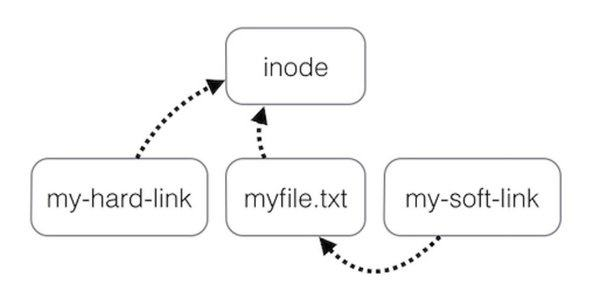

<!--
author: checkking
date: 2017-04-24
title: 硬连接和软连接
tags: unix
category: unix
status: publish
summary: 
-->
### 背景
项目的nginx日志太多了，需要迁移到其他磁盘，另外一个同学采用软链的方式迁移到其他磁盘上，这样不影响现有程序。对于软链和硬连接概念上还是有些模糊，所以总结一下，直接抄Quora上的一个通俗的回答.

### What is the difference between a hard link and a soft link?
Have you ever given a thought to what happens when you store a file on your hard disk?

I will show you.

Let’s create a file first.

```bash
touch myfile
cat > myfile
Hello, world!
```

cat file should display this text:
```bash
cat myfile
Hello, world!
```

Where do you think myfile is stored?

An obvious and correct answer is your hard drive.

**How does Linux know myfile is on the hard drive?**

When you entered “touch myfile” Linux stored the file on the hard drive and assigned it a number. That number is called `inode`.

An inode stores a file’s address, size and plenty of other information, but not its name. A name links to an inode which links to a file.

If, for some reason, the inode is linked with a file is removed, you cannot find the file, even if it is sitting right there on the hard drive.

Thankfully it rarely happens.

A more common scenario is for someone to erroneously write:

```bash
rm myfile
```

It will remove myfile.

Hard links can save you from such nightmarish scenarios.

Creating a hard link means choosing a new name for your file and linking that name of your file’s inode. It is relatively simple to do.

```bash
ln myfile myfileHardLink
```

Now even if someone removes myfile, you will still be able to access your data through myfileHardLink.

Impressive, isn’t it?

**But where do symbolic links fit into all this?**

I have said, hard links connect the name of a file with its inode and you can choose multiple names for a file.

Now, a symbolic link connects the new name of a file with its old name which in turn connects to the inode and finally to the data (file).

This image will summarize my answer more elegantly than I can:




### 动手
```bash
root@instance-8alx1qc6-1:~/tmp# ll -ail
total 20
420794 drwxr-xr-x  2 root root 4096 Apr 24 23:41 ./
446 drwx------ 22 root root 4096 Apr 24 23:35 ../
395269 -rw-r--r--  3 root root   61 Apr 16 23:25 file
395269 -rw-r--r--  3 root root   61 Apr 16 23:25 file.h
395269 -rw-r--r--  3 root root   61 Apr 16 23:25 file.s
394365 lrwxrwxrwx  1 root root    6 Apr 24 23:41 file.ss -> file.s
394365 lrwxrwxrwx  2 root root    6 Apr 24 23:41 file.t -> file.s
```

其中file是原来的文件.

file.h, file.s是`file`的`hard link`, file.ss，file.t都是file.s的软链,其中file.t是通过file.ss生成硬链得来的。

可以看到通过硬连接得来的文件，inode id和原来的是一样的。
