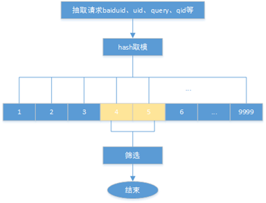
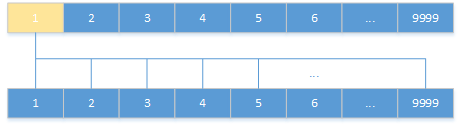

<!--
author: checkking
date: 2017-04-30
title: 谈谈抽样试验
tags: 系统设计
category: 系统设计
status: publish
summary: 谈谈抽样
-->
### 背景
对于一些重要的产品，开发出的新功能往往需要真实流量进行验证才能知道这个功能带来的收益是好还是坏，比如图搜变现的策略rd想要在图搜wise端出游戏的一个广告banner，点击这个广告banner，会跳到一个下载中间页，我们最终的目的是要提高下载量，这就要评估一下哪种下载中间页会提高下载量，当然还有一些其他的评估指标。因此需要从整个流量中抽取两个小部分流量来做对比实验。怎么去分配流量，让不同流量走不同的逻辑就是抽样框架的主要任务。
还有FE开发了一种新的广告样式，需要确认这种样式会不会提高CTR。这些新策略，新样式的上线，都需要灰度发布，也就是小流量实验。

我们的广告模块也实现了一个实验框架，用于灰度发布，我分析一下这个实验框架的细节。

### 实验框架的整体流程
实验用户通过抽样平台上创建抽样试验，比如这个抽样试验要对流量按照uid进行划分，实验组需要流量为1%, 对照组所需流量为1%，如果现有所有流量层有按照cuid划分的，并且这一层上剩余流量充足，则在这一层上选取流量区间分配给实验组和对照组。

则可以将流量区间1000~1099分配给实验组，并创建一个新的sid加入配置，将1100~1199分配给对照组，并创建一个新的sid加入配置。

流量分配好之后，就可以在这个流量下面创建一些策略变量，比如在实验组中这个变量值为x,在对照组中，这个变量值为y（变量需要指定模块）。还可以加入一些过滤条件，对流量进行过滤。比如比如query不能在某个此表中。

实验创建好，并通过审核，准备上线。就会生成两类配置。一类是广告入口模块（midway）所使用的流量划分配置，模块根据这个配置，对请求打上sid列表。传递给下游模块。另外一类配置是各个模块使用的抽样变量配置。程序在运行的时候根据不同sid取得不同的变量值，走不同的逻辑。

配置是通过一个配置配送模块进行的, 各个模块热加载配置。

#### 具体打sid的过程
midway拿到流量分配配置后，解析配置，layermanager将按层解析配置，按层管理各个layer, layer中包含各个抽样节点，比如sid 999的流量区间为start=0, end=999

而且每层的sid都是按照start排序的。后续一个请求hash得到的一个整数就可以按照二分查找。

一个请求过来之后，就会一层一层地去匹配sid，每层最多匹配一个。

#### 查找变量过程

下游模块加载抽样变量配置，热加载，按照变量名组织:

```cpp
struct SampleParam {
    uint32_t sid,;
    void* val;
}
std::unordered_map<std::string, SampleParam> sample_variables.
```

当代码要用到抽样变量时，先到sample_variable中查找，如果不到，则用默认值。

为了统计和评估，在日志中加入sid, 这样可以统计pv,ctr等信息。

### 流量切分
流量划分的粒度为0.1%， 我们将全部流量划分成10000等份，这样全部流量就是0~9999。对输入进行随机hash计算，可以将流量打散在全流量中。
流量可以按照以下几种方式来划分：
1) 按IP来进行划分(地域) <br/>
2) 按UID进行划分<br/>
3) 按cookie进行划分<br/>
4) 按query进行划分<br/>



首先将key对应的字符串用creat_sign_murmur64函数转成64位的整数，然后对10000取模，得到一个0~10000之间的整数。整个整数再去和各个抽样进行匹配，如果在某个抽样区间，则将请求打上对应的sid。

### 实现流量的分层
100%的流量很容易被用完，加入每个实验都需要10%的流量，这样同时只能做10个实验。而且有些实验要求更多的流量，比如有些实验要求在特定query下才走什么要的策略，假如只抽取1%的流量，这样再用这个流量进行query过滤，那就太少了，因此这类实验往往要求很多的流量，比如30%。这样势必会造成流量不够用的情况。

因此需要进行流量分层，将100%的流量正交成16个全流量，从逻辑上将实验流量变成原来的16倍。正交的意思是指第一层的某段很小的1%流量能够均匀地分散到其他层的100%上，而不是集中在其他层的某一段。
正交层之间几乎没有相互影响：

假如有实验1，有实验组exp_a和对照组control_a，各占流量1%,在第一层，第二层中有实验2，有实验组exp_a，占流量2%。如果不正交的话，导致实验1和实验2流量重叠，一个请求要么全部中实验一和实验二，要么全不中。这样两个实验就可能会相互影响了（即使两个实验不互斥）。如果保证正交的话，第一层实验1的流量均匀的落到第二层，这样就只有极少一部分流量落到实验2中的流量。



如果实验1和实验2互斥，比如都要在一个广告位上出广告，这样实验一和实验二必须都在同一层。

分层的实现是为不同层的creat_sign_murmur64函数设置不同的初始化种子字符串实现的，在创建层的时候为每个层分配一个全局唯一的id，作为层的初始化seed。具体代码如下：

```cpp
ErrorCode calc_sample_ratio(const boost::any &any_value,
        const std::string &seed, double &sample_ratio) {
    std::string val;
    if (boost_any_to_str(any_value, val) != SUCCESS) {
        SAMPLE_LOG_FATAL("Failed to convert boost::any to string");
        return FAIL;
    }
    std::string sign_str = seed + val;
    uint64_t sign;
    creat_sign_murmur64(sign_str.c_str(), sign_str.size(), (uint32_t *)(&sign) + 1, 
            (uint32_t *)(&sign));
    // 先进行取模，不然可能导致uint64_t强制转换成double时丢失数据
    sample_ratio = (double)(sign % SAMPLE_MOD) / SAMPLE_MOD;
    return SUCCESS;
}
```

### AB Test
简单理解为将一群人分成两类，通过展示新旧版version A/B来测试哪种版本效果好，差异是多少。


为了进行AB Test, 对照组和实验组，拥有不同的sid, 通常在notice日志中进行埋点，日志中sid可以区分不同的实验，这样可以对比实验组的和对照组的CTR等指标。
