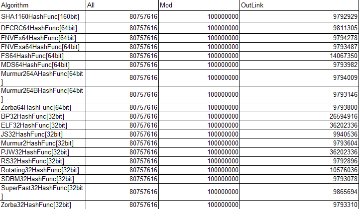

<!--
author: checkking
date: 2017-04-30
title: 签名算法的选取
tags: 系统设计
category: 系统设计
status: publish
summary:  抽样框架签名算法的调研
-->
### 背景
由于抽样框架需要根据各个请求的字段(query, ip, cookie, uid等)进行hash得到对应的sid，一个高效、合理的签名算法尤为重要。

#### 签名算法选取的要点
- 速度 线上每个请求都要进行签名计算，速度尤为重要, 速度的计算要区分长串和短串
- 冲突率 如果冲突率高的签名算法，pass掉
- 取模冲突率 

#### 测试方法
- 速度测试上,为了减少IO对于CPU的影响[虽然计时部分是在纯CPU计算上,但是过短的start和stop会造成计时不准].所以每次读取1024条记录批量进行求签名.

数据准备：速度的测试数据是自己构造的,包括32,64,128,..33554432字节长度的二进制串，
因为所有算法并没有根据字符串的内容来做特殊处理,所以这里的二进制串是随机生成的.

- 签名冲突率测试上
数据准备： 数据是使用ps提供的url和query.其中url规模1亿,query规模8千万.

- 取模冲突率测试上
数据是使用query规模8千万,开辟的桶大小1亿.
开辟1亿个桶大小,然后测试每个桶上面的外链长度.这里使用了一种简单的表示外链长度的算法.

### 测试速度结果
- 64位平台下面运行[MB/s] (其中32[100]表示32字节的二进制串运行100次)

- 32位平台下面运行[MB/s] (其中32[100]表示32字节的二进制串运行100次)

### 测试冲突率结果
#### query处理冲突
- All表示总个数,Distinct表示签名认为不重复的个数,Rate表示冲突率
- 每一个query都是字符串不重复的
- 因为query个数相对于64/128位签名算法到达冲突的个数远远不够,所以很多64/128位签名算法冲突率为0

### 取模冲突

### 分析和结论

#### 速度分析
- 在64位平台下面,性能最好的三个就是 Zorba[64bit] 和 Murmur2A[64bit] 还有Murmur2B[64bit]. 这三个签名函数的32位版本在64位平台下面性能也是最优越的. 但是在短串处理上, Murmur2A[64bit]和Murmur2B[64bit]高于Zorba[64bit]. Zorba[128bit] 也是远远好于同类签名函数.
- 在32位平台下面,性能最好的三个是 BobJenkins3[64bit] , Murmur2B[64bit] .分别达到了 630MB/s 和 510MB/s .而性能最优的32版本是 BobJenkins3[32bit] 和 SuperFast[32bit] .
- 所以比较有竞争力的3个签名函数是 Zorba , BobJenkins3 , Murmur2B .不过Zorba只能够在64位平台下面使用,而BobJenkins3只有在32位平台运行效率高

#### 冲突率分析
- 从现在的数据来看,仅仅能够分析32位签名的冲突率
- 基本上32位签名的冲突率都还好。个别冲突率比较高，比如 BP[32bit] , ELF[32bit] , PJW[32bit]
- 64位签名 FNVEx[64bit] , FNVExa[64bit] , DPFCRC[64bit] 这几个函数都有点不太给力.其他签名函数还没有出现冲突之前就已经发生冲突了

#### 取模分析
- 对于之前几个在签名冲突不给力在取模冲突上面表现也不好.
- 理想情况下面每个key都应该均匀分析,所以外链长度应该是8075761.6.

### 结论
- 如果使用32位签名,那么可以考虑使用 Murmur2B[32bit] .
- 如果使用64位签名,那么可以考虑使用 Zorba[64bit]和Murmur2A[64bit]. 注意对于短串[<=1024字节]Murmur2A效率高,长串[>=1024字节]Zorba效率高.
- 如果使用128位签名,那么可以考虑使用 Zorba[128bit] .

对于抽样框架，应该选择Murmur2A, 也就是creat_sign_murmur64方法.

### 参考
1. http://burtleburtle.net/bob/
2. http://sites.google.com/site/murmurhash/
3. http://www.partow.net/programming/hashfunctions/index.html
4. http://en.wikipedia.org/wiki/Birthday_attack

### 附件

[详细实验数据](../../docs/201704/signResearch.xlsx)
